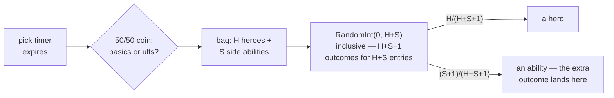
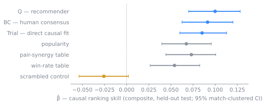
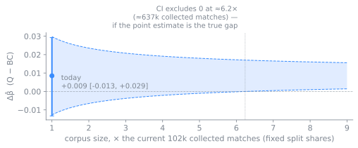
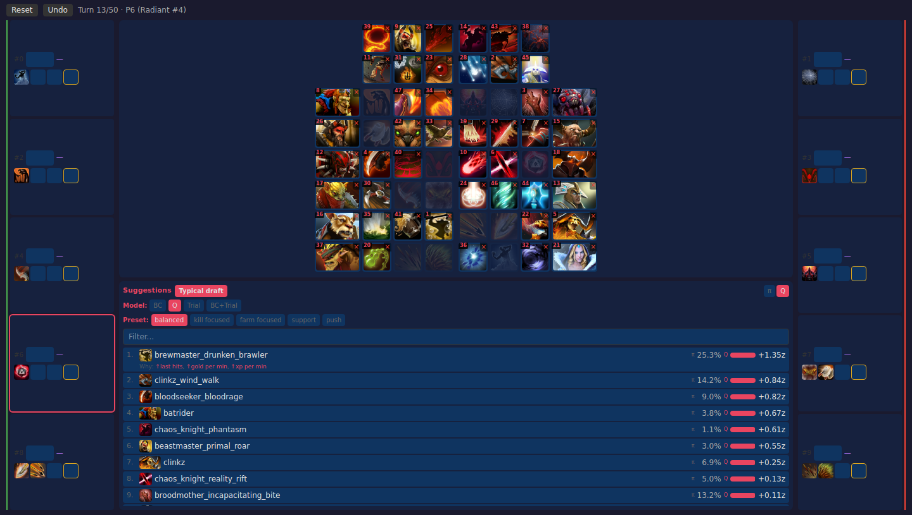

# DraftedAtRandom

*Dota 2's pick timer runs a randomized experiment every day — we decompiled its
odds and used them to causally score draft advice.*

Every time a Dota 2 player lets the pick timer run out in **Ability Draft**, the
server picks for them — at random. That accident makes the game a natural
science experiment: for years, abilities have been handed to players by a
random number generator, and by watching how those matches turn out we can
measure whether draft decisions actually matter. **The result: causal
conclusions from observational replays — earned on the subpopulation of picks
where the server itself did the randomizing.**

In Ability Draft, ten players take turns building custom heroes from a shared
ability pool before the match starts. Was a pick *good*? You can't just check
whether players who picked it won more, because skilled players both pick
differently *and* play better — the pick's effect is *confounded* with the
player's skill, and you'd never know which caused the win. Timeout picks don't
have this problem: the player didn't choose, the server did. A two-week sweep
of replays contains <!--n exclusions: {n_forced_nonbot:,} forced picks-->85,929 forced picks<!--/n-->
of exactly that kind.

One more ingredient is needed: measuring effects without bias requires knowing
the exact odds of each possible assignment, not just that it was "random." So
we decompiled the assignment rule out of the game's own binary. It is *not*
uniform: the server first flips a 50/50 coin between basic abilities and
ultimates, then draws one option uniformly from the heroes plus the chosen
side. Along the way we found **a genuine off-by-one mistake in Valve's code**: the
draw calls `RandomInt(0, N)` for a bag of `N` items, and that function includes
both endpoints — `N+1` possible outcomes for `N` items, with the one extra
outcome always falling on the ability side — so whenever a hero is still in
the bag, the draw is tilted slightly toward abilities. We checked all of it against reality: bot lobbies
reproduce the rule exactly, and the replay data statistically prefers the buggy
version over the corrected one
(see [`experiments/random-mechanism`](experiments/random-mechanism/)). Every
forced pick therefore comes with a known probability — which is exactly what a
randomized experiment needs.



Around that experiment the repo carries everything it needs and everything it
tests: replay
collection and parsing, a model trained to imitate what players usually pick
(**BC**, for "behavior cloning" — think of it as the crowd's consensus), a
recommender trained on top of it to maximize predicted performance (**Q**), and
a web app serving both.

## Findings

How to read the numbers: **β̂** is the effect measure — how strongly a method's
ranking of the legal picks predicts how the *randomly assigned* pick actually
turned out. Zero means the ranking carries no real information; positive means
it genuinely identifies better abilities. Brackets are 95% confidence
intervals, and every number below comes from matches the models never saw
during training (patch 7.41; details, caveats, and derivations in
[REPORT.md](REPORT.md)).



- **Draft picks really matter, and good rankings can see it.** When the crowd's
  consensus ranks a randomly assigned pick highly, that pick genuinely tends to
  work out better — composite
  <!--n stats-causal-rank: β̂ = {beta_bc:+.3f} [{beta_bc_lo:+.3f}, {beta_bc_hi:+.3f}]-->β̂ = +0.091 [+0.063, +0.120]<!--/n--> (BC) — and
  the trained recommender does the same
  (<!--n stats-causal-rank: {beta_q:+.3f} [{beta_q_lo:+.3f}, {beta_q_hi:+.3f}]-->+0.100 [+0.070, +0.128]<!--/n--> for Q), while a
  deliberately scrambled ranking finds nothing, as it should. A typical human
  pick also clearly beats pure chance
  (<!--n stats-recommender-value: {typical_minus_random:+.3f}-->+0.507<!--/n--> on the combined
  performance score — a different scale from β̂ — about a tenth of a standard
  deviation per pick)
  (REPORT.md §5–6; [`stats-causal-rank`](experiments/stats-causal-rank/),
  [`stats-recommender-value`](experiments/stats-recommender-value/)).
- **Most of the crowd's wisdom is just popularity.** A ranking that knows
  nothing about the current draft — only which abilities players pick most —
  already recovers <!--n static-rank: ≈ {share_of_bc_pct:.0f}% of the consensus's effect-->≈ 74% of the consensus's effect<!--/n-->;
  the win-rate and combo tables the community drafts by (as served by community
  stat sites — e.g., [windrun.io](https://windrun.io) — rebuilt from our own
  data) land in the same band
  (<!--n static-rank: ≈ {wr_raw_share_pct:.0f}–{pair_raw_share_pct:.0f}% of BC-->≈ 59–80% of BC<!--/n-->, point
  estimates). The consensus leans above all of them, but the data resolves that
  lead only against the win-rate table
  (REPORT.md §6; [`stats-causal-rank`](experiments/stats-causal-rank/)).
- **Training did not produce a better drafter — only one provably about as
  good.** The recommender keeps at least
  <!--n stats-causal-rank: ~{rho_lo:.0%} of the consensus ranking skill-->~87% of the consensus ranking skill<!--/n--> (a
  statistical worst case at 95% confidence), and its small positive lean —
  Δβ̂ <!--n stats-causal-rank: {dbeta:+.3f} [{dbeta_lo:+.3f}, {dbeta_hi:+.3f}]-->+0.009 [-0.013, +0.029]<!--/n--> — could
  be zero. What it adds is a capability rather than an edge: it predicts
  effects stat by stat —
  <!--n stats-causal-rank: {perstat_bhfdr_q_heads} of 26-->19 of 26<!--/n--> of those per-stat
  predictions check out against the same experiment — so its advice can be
  tilted toward a play style (the app's kill/farm/support/push presets) —
  something the consensus cannot offer. Whether a truly better
  drafter *exists* stays an open question: logs at this data size cannot settle
  it; more randomized picks — or a live A/B — could (REPORT.md §6;
  [`stats-recommender-value`](experiments/stats-recommender-value/),
  [`stats-cql-vs-bc`](experiments/stats-cql-vs-bc/)).
- **No sign that skill lives in the picks themselves.** Condition the consensus
  model on a genuine (stats-based) measure of player skill and it drafts
  *differently* — but not detectably *better*: Δβ̂
  <!--n stats-skill-headroom: {dbeta_high_low:+.3f} [{dbeta_high_low_lo:+.3f}, {dbeta_high_low_hi:+.3f}]-->+0.001 [-0.002, +0.004]<!--/n-->
  (REPORT.md §6; [`stats-skill-headroom`](experiments/stats-skill-headroom/)).
- **Threats are measured where measurable, bounded where not.** Everything we
  excluded (bot matches, games with leavers, post-draft ability swaps, matches
  without extended stats) was checked for whether it could distort the result —
  these are bounds, not proofs of absence. One bias has a known direction:
  players handed a bad random pick sometimes abandon the match, and abandoned
  matches never reach the data — that hides bad outcomes for bad picks, so our
  estimates err on the small side, with the unmeasurable remainder held by a
  sensitivity analysis
  (REPORT.md §3, §6–7; [`random-mechanism`](experiments/random-mechanism/),
  [`stats-generalization`](experiments/stats-generalization/)).

When two intervals overlap, that is a data-size limit, not a dead end: the
intervals shrink as the corpus grows, and the game creates fresh timeout picks
every day.



The band above is the open "is Q better than the crowd?" question from the
ladder. Its width shrinks with the square root of the data — the standard rate
for an average — so, if the current point estimate is the true gap, the
question resolves at
<!--n stats-causal-rank: ≈{nstar_dbeta_x:.0f}× the current corpus (≈{nstar_dbeta_kmatches:.0f}k collected matches)-->≈6× the current corpus (≈637k collected matches)<!--/n-->.
That is guidance for reproducing on a larger collection, not a prediction: a
bigger corpus also retrains the models, which moves the estimate itself.
Collection is also not the only lever — the precision is set by how many
forced picks land in the held-out measurement set, so a reproduction aimed at
this question can hold out a larger share of the same corpus for measurement,
trading model-training data for resolution.

The effects above are measured where the randomization lives: on picks made by
the timer, for players who let it run out. Treating them as true for picks
players choose deliberately is an extrapolation — we probe it every way the
data allows, and the effect looks the same in every subgroup we can measure,
but differences we cannot observe (say, how engaged a player who lets the
timer expire was) could still matter. The other thing replays cannot settle at
any sample size is whether following the advice helps a player in real use.
Both questions take a live A/B test (REPORT.md §7–8;
[`stats-generalization`](experiments/stats-generalization/)).

## Repo map

| path | what |
|---|---|
| [`REPORT.md`](REPORT.md) | the full technical report: methods, math, results, limitations |
| [`src/dota2ad/`](src/dota2ad/) | library — pipeline (collect/parse/build), models, training, eval, inference server |
| [`experiments/`](experiments/) | one directory per training/eval experiment, each with its own README and pixi task |
| [`experiments/RUNBOOK.md`](experiments/RUNBOOK.md) | the exact reproduction pipeline |
| [`dota2-ad-parser/`](dota2-ad-parser/) | Java (Clarity) replay parser → per-match draft JSON |
| [`web/`](web/) | the draft UI (Vite + React) served against the inference API |

## Reproduce

Requirements: [pixi](https://pixi.sh), JDK 17 (parser build), a CUDA GPU for
training. No API keys needed: replay discovery pages OpenDota's public index
(an `OPENDOTA_API_KEY` lifts rate limits; a Steam key is only for the
alternative `--source steam` sequence scan).

```bash
pixi install
git submodule update --init                  # dota2-ad-parser (only needed for replay collection)
(cd dota2-ad-parser && mvn package)          # needs JDK 17

export OPENDOTA_API_KEY=...                  # optional — lifts OpenDota rate limits
export DOTA2AD_ROOT=work
pixi run collect -- -n 100000                # discover + download + parse AD replays
pixi run build-dataset                       # matches.jsonl, split, vocabs, match_stats
ROOT=work bash experiments/run_all.sh        # train everything, run the full eval suite (GPU)
pixi run check-docs                          # verify the report's numbers against your run
```

Every figure quoted in this README and the report is written by the pipeline
into a results manifest and mechanically verified in place by `check-docs`.
Valve serves replays for only ~2 weeks, so a fresh collection samples the
current patch — your numbers will differ from the report's, and the same check
lists exactly which quoted figures moved. That is the intended way to replicate
this work: rerun it on a fresh patch and see what holds
(REPORT.md §7). The per-player extended stats come from OpenDota's parser via its
API; if you can obtain the `.dem` replay files by other means, you can bypass that
dependency by running [OpenDota's open-source parser](https://github.com/odota/parser)
over them yourself (the draft side already comes from our own parser on the same
files). To run one experiment or resume a partial pipeline, see the
[RUNBOOK](experiments/RUNBOOK.md).

The trained checkpoints and result manifests
ship with the repo (`work/models/`, `work/results/`), so on a fresh clone
`pixi run check-docs` passes and the app serves without running the pipeline:
`pixi run backend` and `pixi run frontend`.



## AI disclosure

This project was developed in collaboration with AI assistants: most of the
code and prose, including [REPORT.md](REPORT.md), was drafted by them under
human direction; the research questions, design decisions, and review are the
author's. That review was not exhaustive — no human has checked every line of
code or prose, and errors may remain. Read critically, take every claim with a
grain of salt, and verify before relying on anything here; responsibility for
any use of the code or conclusions rests with the reader, and the repo is
built to make verification practical (rerun the pipeline, `check-docs` diffs
every quoted figure). The result figures themselves are not transcribed by
hand or by a model — each is written by the pipeline into a results manifest
and mechanically checked in place — but that guards transcription, not the
correctness of the underlying analysis.
