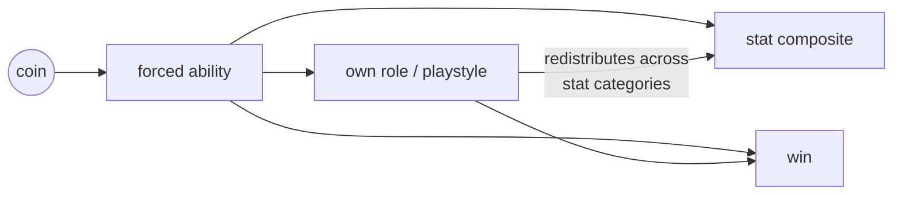
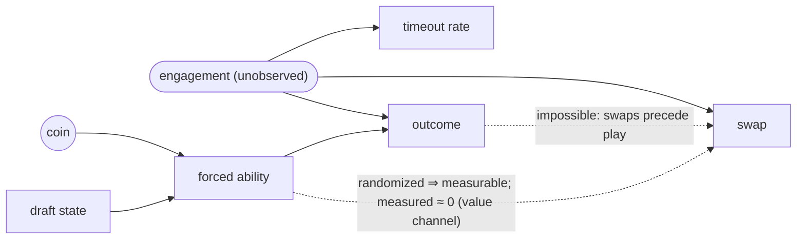

# Causally evaluating Dota 2 Ability-Draft decisions — from replays, without A/B tests

This is the full story behind [the README](README.md): the methods, the math,
every number, and every caveat. If you just want what we found, the README's
five bullets cover it — this report is for checking the work.

The one-paragraph recap: Dota 2's pick timer assigns abilities at random, and
we decompiled the exact odds it uses from the game binaries — catching a
genuine off-by-one in Valve's `RandomInt` call, which the pick data itself
confirms. That turns plain replays into a randomized experiment for scoring
draft advice. Scored on it, human consensus and our trained recommender both
rank abilities by their true causal effect (for timeout-assigned picks, in
completed no-swap matches, on one patch); context-free community tables
recover <!--n static-rank: {wr_raw_share_pct:.0f}–{pair_raw_share_pct:.0f}%-->59–80%<!--/n-->
of the consensus's effect; the recommender retains
<!--n stats-causal-rank: at least ~{rho_lo:.0%}-->at least ~87%<!--/n--> of it, with any
edge unresolved; and whether a better-than-human drafter exists — or whether
following the advice helps in real play — needs more data or a live A/B. The
recommender we built and serve is one of the rankers under evaluation.

---

## 1. The question

An AD match has 50 draft turns: each of 10 seats picks 5 times (1 hero + 4
abilities) from a shared, match-specific pool, in snake order. We recommend a single
pick to one **focal** player at one decision point, given the draft so far. The
other nine seats are treated as playing like a typical human.

Building a recommender is the easy part — prior MOBA draft systems [@chen2018draftartist;
@chen2021juewu; @lee2022draftrec] and Dota-2 draft-pick prediction [@summerville2016draft] already do it,
optimizing predicted *win-rate* (and self-play gameplay agents [@berner2019dota] rank
drafts as a by-product of their learned value functions). Knowing whether it is any *good* is the
hard part — and "good" has to mean **causal**: if a player follows the advice, do
they actually end up better off?

**That question, precisely.** "Does the advice cause better outcomes?" unpacks into four
questions of increasing ambition, and this report is explicit about which rung it stands on:

1. **Local rank association** — does the recommender's *ordering* of the legal abilities
   track those abilities' causal effects, one pick at a time? *This is what the report
   establishes* (§5–§6), from the game's own randomization.
2. **Local policy value** — how much is *following* a given policy worth, for one pick?
   *Probed, exploratory* (§6's value section): identified in principle by the same
   randomization, but read through its structurally noisiest contrasts.
3. **Effects for deliberate users** — does the advice help a player who chooses to follow
   it? *Not identified here*: the randomized picks come from timeout states, and
   transporting them to deliberate use needs assumptions §7 declines to make.
4. **Whole-draft deployment value** — do five advised picks compound into more wins?
   *Not identified here* (§8): a live A/B is the instrument for this and for rung 3.

The report answers rung 1, probes rung 2, and treats rungs 3–4 as the honest boundary of
what logs alone can say. The tempting shortcut — "do the model's favorite
picks correlate with good outcomes?" — does not measure any rung of this, as the next
section shows.

## 2. Why "correlate the model's picks with outcomes" fails

Suppose we score every historical pick by how much the model likes it, and check
whether its favorite picks came from matches with better outcomes. A positive
correlation would be reassuring — and misleading.

**Skilled players tend to both pick well and win, for reasons that have nothing to
do with any single pick** — better teamfighting, map awareness, coordination. So
"the model likes the picks that skilled players make, and skilled players win"
produces a positive correlation *even if the ability itself did nothing*. The pick
and the outcome share a hidden common cause: the player's skill. This is
**confounding**, and it is why observational correlations do not measure causation. (Recommender-systems and
learning-to-rank work reaches the same conclusion — logged feedback is biased, so evaluation
must be made counterfactual [@schnabel2016treatments; @joachims2017unbiased] — though there
the bias is exposure or position, not confounding by skill.) And the bias is not
hypothetical — it is measured: scoring the same rankers on *deliberate* (chosen) picks
<!--n naive-bias: yields {naive_bc:+.3f} for the human baseline and {naive_q:+.3f} for the-->yields +0.130 for the human baseline and +0.178 for the<!--/n--> recommender, against the causal
<!--n stats-causal-rank: {beta_bc:+.3f} and {beta_q:+.3f}-->+0.091 and +0.100<!--/n--> that §6's randomized picks deliver — <!--n naive-bias: inflations of ~{inflation_bc_pct:.0f}% and ~{inflation_q_pct:.0f}%-->inflations of ~42% and ~78%<!--/n-->,
plus a spurious recommender-over-human gap that the randomization erases
(`stats-causal-rank/naive_bias.py`).

The clean fix is a randomized experiment — assign the pick *at random* and compare
outcomes, so no skill-like trait can be secretly driving both. Randomization severs
the link between the player and the pick. But we have only historical logs and
cannot run experiments on live players.

## 3. The game runs a randomized experiment for us

Here is the lucky break. In about <!--n dataset: **{forced_share:.1%} of AD picks-->**1.6% of AD picks<!--/n--> the player lets the turn timer
expire, and the server assigns a random legal ability by a fixed, known rule.** For those
picks — the **random picks** — the ability was chosen by the game's coin flip, not by the
player's skill or intent. (That rule is not a plain uniform draw over legal abilities; it
is a side-coin then a uniform draw within the chosen side — carrying a genuine off-by-one
mistake in the game's own code: an inclusive `RandomInt(0, N)` over an `N`-item bag, whose
extra outcome always lands on the ability side, a bug the pick data itself confirms — reverse-engineered from the game
binaries and verified against the data — `random-mechanism`. Because it is known exactly, we
weight each pick by its true propensity so the estimator targets the uniform-over-actions
effect regardless.)

That is exactly the randomized experiment we could not run, embedded in the logs.
For a random pick:

- the ability is **independent of the player's skill, the meta, everything** — it is
  a draw from a known, fixed rule over whatever was legal at that instant; and
- therefore any relationship between *which ability the coin handed the player* and
  *how that player's game turned out* is **causal**, not confounded.

We do not need the model to make this true — the game made it true. Harvesting accidental
randomization from logs is an established move [@langford2008scavenging; @strehl2010implicit];
its usual cost is that the logger's propensities must be *estimated* from those same logs, and
here that cost vanishes — the assignment rule is decompiled from the server binary and
verified, so the propensity is known exactly (§5, `random-mechanism`). Our job is to
turn these <!--n dataset: ~{forced_share:.1%} of picks-->~1.6% of picks<!--/n--> into a measuring stick for any recommender [@bottou2013counterfactual]. (Bot-like timeout spam,
leavers, and post-draft swaps are excluded — §6 has the exact sample flow; the rest yield
<!--n dataset: {n_forced:,} forced-random picks across {n_forced_matches:,} matches-->63,937 forced-random picks across 35,861 matches<!--/n--> to work with.)

Three honest caveats — the first two revisited in §7, the third in §6:

- **Random picks are a special subgroup** — moments where *someone let the timer
  run*. Conclusions are cleanest *for that subgroup*; extending them to deliberate
  picks or a deployed app needs an extra assumption.
- **It measures one pick at a time.** The clean causal object is the effect of a
  single forced pick, with the rest of the draft playing out as usual — not the
  value of following a recommender for all five of a player's picks.
- **The record of the experiment is itself outcome-dependent.** A match enters the
  corpus only if it completed and was recorded, and matches abandoned after a bad
  forced pick can vanish before that. The recorded forced picks therefore skew
  mildly toward desirable items — a deviation measured against the exact mechanism
  (`random-mechanism`): <!--n survivorship: ~{shift_sd:+.3f} SD in outcome units-->~+0.003 SD in outcome units<!--/n-->, essentially none of it explained
  by our own leaver exclusion (tested), so it sits at the recording boundary itself.
  Within that boundary the measurable slice — matches indexed but with unserved
  replays, <!--n retrieval: ~{gone_share:.0%}-->~2%<!--/n--> — is outcome-balanced and traces to specific replay servers (§6), which
  points the suppression at matches never indexed at all. The *measured* component of
  this works against the results rather than for them — correcting it raises β̂ — and
  a sensitivity sweep bounds the unmeasured remainder: within its model, no strength of
  outcome-tilted recording flips the effect's sign — the reweighting degenerates long
  before any tipping point (§5.3).

## 4. What we test, and the models involved

Three learned models appear:

- **BC** ("behavior clone") — a network trained to predict the *human* pick at each
  decision point. It serves as our **human-consensus baseline** (what players
  converge on at a given skill level) and as the assumed behavior of the other nine
  seats.
- **StatsModel** — given a *completed* draft, predicts each player's end-game
  statistics (kills, gold, last-hits, …). It is a component used to train the
  recommender; it is not itself the thing we causally test.
- **Q** (the **recommender**) — given the draft so far, scores each legal ability by
  its predicted effect on a weighted basket of stats. One semantic note: Q's training
  rolls the focal player's *own remaining picks* from Q itself (the other nine seats
  from BC), so its scores are full-adherence values — "the effect of this pick if the
  player keeps following Q" — not take-one-suggestion values. The test below never
  relies on that semantics: it checks only whether Q's *ordering* of the legal
  abilities tracks the true single-pick effects under the player's natural
  continuation. This is the shipped model whose causal quality we want to measure.

The evaluation treats each of these — plus a deliberately scrambled control — simply
as a **ranker**: something that, at a decision point, assigns a score to each legal
ability. The test below applies to *any* ranker.

## 5. The test

### 5.1 The intuition

At a random pick, the server forced some ability `A`. A ranker, looking only at the
draft so far, scores all the legal abilities. **Where did the forced ability land in
that ranking?** If the ranker is causally smart, then random picks where it ranked
the forced ability *highly* should tend to have *better realized outcomes*, and
picks where it ranked it *poorly* should have worse ones. If the ranker's opinion has
nothing to do with reality, its ranking of the (randomly chosen) ability should be
unrelated to the outcome. Because the ability was forced at random, any such
relationship is **causal**. That is the whole test.

### 5.2 The estimator

Make "where did the forced ability land" precise as a **within-state deviation**: at
a given draft state, take the ranker's score for the forced ability, minus the
average score it assigns the legal abilities there. Call it `δ`. Positive `δ` means
the ranker liked the forced ability more than average; negative, less. Then

$$
\hat\beta \;=\; \text{average over random picks of }\big(\, \delta \times \text{realized outcome} \,\big).
$$

In plain words: **when the ranker liked the forced pick more than average, was the
outcome better than average?** A positive `β̂` means yes — the ranker orders
abilities by their real effect. Throughout, a ranker scores the **draft as it stood
at the decision point** — exactly the information a real recommender would have. We compute it per end-game stat and for a balanced
composite, with 95% confidence intervals from a *match-clustered* bootstrap (several
random picks can share a match, so we resample matches, not picks). Matches are not
perfectly independent either — players repeat across them (the corpus's 102k matches share
<!--n rating: {n_accounts:,} accounts, {n_accounts_ge2:,} appearing in ≥2-->103,487 accounts, 71,607 appearing in ≥2<!--/n-->) — so the clustering choice is itself checked:
re-running the bootstrap clustered by the *focal picker's account* leaves the CI widths
essentially unchanged (<!--n cluster-sensitivity: BC identical; Q shifts ≈{q_account_widening:+.0%}-->BC identical; Q shifts ≈-1%<!--/n-->), and calendar-day blocks come out no
<!--n cluster-sensitivity: wider ({n_clusters_day} blocks-->wider (13 blocks<!--/n--> — a coarse read)
(`stats-causal-rank/cluster_sensitivity.py`). Match clustering is the reported unit.

### 5.3 Match-level noise cancels within the state

A player's end-game stats swing wildly from match to match for
reasons unrelated to any single ability — game length, teammates, whether it was a
stomp. That match-level component widens the error bars but **cannot bias** the
answer, for a simple
reason. The match-level "how the game went overall" component is **the same for
every ability we could have picked in that draft** — it is a property of the state,
not of the forced ability. And `δ` is measured *relative to the average ability in
that same state*. So when we multiply `δ` by the outcome, the shared match-level part
multiplies something that averages to zero within each draft, and it cancels. Only
the ability-specific part survives. Writing the outcome as
`context(state) + ability effect + game noise`,

$$
\mathbb{E}[\hat\beta] \;=\; \mathbb{E}_{\text{states}}\big[\, \mathrm{Cov}_{\text{abilities}}(\text{ranker score},\ \text{true ability effect}) \,\big]
$$

— the context term is annihilated because `δ` sums to zero over the legal abilities,
the game noise averages out because the forced ability was random, and what remains
is exactly "does the ranker's score track the true ability effect." (Full derivation:
[Appendix A](#appendix-a-the-estimator-formally).)

One premise deserves flagging: all of this holds for draws from the assignment rule
itself. The *recorded* sample departs from that rule slightly — abandoned matches never
reach the corpus, so undesirable forced picks are mildly under-represented. The
**measured** part of that departure — which *items* survive to the corpus — runs against
the results, not for them: reweighting the recorded picks back to the mechanism *raises*
β̂ by <!--n beta-bias: ~{atten_bc:.0%} (BC) / ~{atten_q:.0%} (Q)-->~12% (BC) / ~11% (Q)<!--/n--> and leaves their gap unchanged, so the numbers below are, on
that axis, understated. What the item axis cannot see is selection on the *outcome*
itself; that residual is unmodeled and its sign unknown, so it is bounded rather than
assumed away: with recording odds tilted by outcome as $P(\text{record}\mid y) \propto
e^{\gamma y}$, no finite $|\gamma|$ drives β̂ to zero (tipping value: <!--n beta-bias: {tip_gamma:.2f}-->inf<!--/n-->) while
the measured channels calibrate <!--n beta-bias: ($\|\gamma\| \lesssim {gamma_band:.2f}$)-->($|\gamma| \lesssim 0.11$)<!--/n--> — and at
that calibrated band edge <!--n beta-bias: β̂ = {band_edge_beta:+.3f} [{band_edge_beta_lo:+.3f}, {band_edge_beta_hi:+.3f}], still clear of zero-->β̂ = +0.104 [+0.061, +0.146], still clear of zero<!--/n-->
(`random-mechanism`, §6).

One more piece of design fine print. Several forced picks can land in one draft, every
pick reshapes the shared pool available to later picks, and all ten players' outcomes
come out of a single game — the randomized units are not isolated from one another. What
randomization identifies here is therefore the **total effect of assigning** an ability
[@hudgens2008interference]:
everything the assignment changes downstream is part of the effect, including the pool it
denies to everyone else, the picks teammates and opponents make in response, and the game
that results. What it cannot identify — and this report never claims — is the ability's
*isolated* or *intrinsic* effect, independent of how it changes the rest of the match: no
pick can be made without changing the environment for the other nine players, so that
counterfactual does not exist in the data. The estimand is built to be exactly the total
effect. The unit is a *pick-in-context* — everything earlier, other forced picks
included, is part of its state — and its potential outcome is defined under the *natural
continuation*, so everything later is part of what the pick causes. Coarser objects (a
player's whole draft, a match) are what §8 declines to claim, and the residual
same-match *dependence* between units is an inference matter rather than an
identification one: the confidence intervals resample whole matches (§5.2) so that
exactly this correlation is priced in.

**The most intuitive mediated path deserves its own naming: the forced ability changes
how its *own* player plays.** Hand a would-be farmer a support ability and they may
rotate more, farm less, heal more — the stat profile shifts because the *role* shifts.
That path is part of the effect, not a bias — a pick's value includes the playstyle it
enables — and cutting it out (an effect "holding role fixed") is neither wanted nor
identifiable: role is downstream of the assignment, and conditioning on anything
downstream would undo the randomization. It does matter for *reading the composite*,
though: the primary endpoint is deliberately narrow — six individually-attributable,
goal-aligned stats (§6) with a farm-and-fight flavor — so a role shift redistributes
performance across categories, and an ability that causes support play can score below
its contribution on this bundle. β̂ on the composite is the total effect *on that
bundle*, role adaptation included. Two readings keep this honest: the **win** outcome,
which no redistribution between stat categories can move, is reported alongside it —
both rankers resolve there too (§6), which pure role-steering of stats could not
produce — and the secondary per-stat battery (26 stats, healing and stuns and
objectives included) makes the redistribution visible rather than folded away.



*Every arrow out of the forced ability is part of the estimand — β̂ is the total
effect, both paths into the composite included. The redistribution edge can move the
composite without moving win, which is why win is read alongside it.*

### 5.4 Two ways to read the ranking

We report the test in two flavors, which weight the ranking differently:

- **rank** (primary): position only — was the forced ability near the top or bottom
  of the ranker's order? Robust; our headline.
- **score** (secondary): magnitude — a ranker that is *very confident* about a pick
  gets more weight. Shown for transparency.

Both resolve the same positives and the same null; the score transform runs wider
throughout, so wherever a margin is at stake the rank transform decides. (§6 adds a *third* reading of the same estimator —
the realized value of a deployed policy's picks — and shows how all three relate.)

## 6. Results

**Sample** (one game patch). The corpus is every Ability-Draft match OpenDota indexed in a
contiguous collection window of the patch whose replay Valve served at fetch time. The
replay-retrieval layer <!--n dataset: censors {n_gone:,} discovered matches-->censors 2,104 discovered matches<!--/n--> (<!--n retrieval: ~{gone_share:.0%}-->~2%<!--/n-->; recorded in
`dataset/gone_matches.jsonl`): they are outcome-balanced against the corpus (win <!--n retrieval: {win_gap_pp:+.1f}pp-->+1.6pp<!--/n-->,
<!--n retrieval: z={win_z:+.1f}; no short-game excess-->z=+1.3; no short-game excess<!--/n-->), <!--n retrieval: carry *fewer* leavers ({leaver_gone:.1%} vs {leaver_retrieved:.1%})-->carry *fewer* leavers (9.6% vs 17.1%)<!--/n--> — the opposite of
abandonment selection — and concentrate in infrastructure: <!--n retrieval: ~{cluster_top12_share:.0%} sit-->~89% sit<!--/n--> on two replay
clusters whose hosts refused our fetches. Cutting across clusters, OpenDota's parse marker shows
<!--n retrieval: {od_parsed_share:.0%} of the gone matches-->22% of the gone matches<!--/n--> demonstrably existed — served to OpenDota while
fresh, then expired or refused before our sweep, including some on the refusing clusters
themselves; the unparsed remainder sits mostly on those clusters and was plausibly never served
to anyone, though never-served is not provable from here
(`random-mechanism/retrieval.py`). Infrastructure and expiry timing, not behavior. The layer above —
matches OpenDota never indexed at all — is unmeasurable from here; it is where §3's recording
caveat lives. The retrieved corpus is filtered to an analytic set and split
three ways by match; the β̂ results below are computed on the **held-out test
forced-random picks**, not the whole corpus:

| stage | count | note |
|---|---|---|
| raw matches <!--n dataset: \| {n_raw:,} \| corpus-->| 102,096 | corpus<!--/n--> — gameplay patch **7.41**, public AD lobbies collected **2026-06-08 → 2026-06-20** (UTC start times; `stats-skill-headroom/premise.py` prints the window) |
| excluded <!--n dataset: \| {n_excluded:,} \| bots {n_bots:,} + leavers {n_leavers:,} + swaps {n_swaps:,}-->| 22,856 | bots 494 + leavers 17,192 + swaps 5,941<!--/n--> (categories overlap ⇒ union < sum) |
| **analytic matches** | <!--n dataset: **{n_analytic:,}** \| raw − excluded-->**79,240** | raw − excluded<!--/n-->; the default loaded set |
| &nbsp;&nbsp;<!--n dataset: — train \| {n_train:,} \| model fitting-->— train | 47,575 | model fitting<!--/n--> |
| &nbsp;&nbsp;<!--n dataset: — validation \| {n_val:,} \|-->— validation | 15,828 |<!--/n--> every *selection* decision: training epochs, the recommender's checkpoint metric, early stopping, the tilt-parameter sweep, calibration, diagnostics |
| &nbsp;&nbsp;<!--n dataset: — test (held-out) \| {n_test:,} \|-->— test (held-out) | 15,837 |<!--/n--> final evaluation only — read once, by nothing else |
| stats-available <!--n stats-coverage: \| {n_parsed:,} \| analytic matches-->| 74,798 | analytic matches<!--/n--> **OpenDota-parsed** (extended stats: gold_t, damage, stuns…); the other <!--n stats-coverage: ~{unparsed_share:.0%}-->~6%<!--/n--> were collected-but-unparsed by OpenDota |
| forced-random picks | <!--n dataset: {n_forced:,}-->63,937<!--/n--> | the natural-experiment sample — <!--n dataset: {n_train_forced:,} train / {n_val_forced:,} val / **{n_test_forced:,} test**-->38,302 train / 12,885 val / **12,750 test**<!--/n-->; the stats/feasibility filters below trim the test slice to the β̂ denominator |

All β̂ results below use the **<!--n stats-causal-rank: {n_picks:,} held-out test forced-random picks-->12,310 held-out test forced-random picks<!--/n-->** (6,834 matches;
a forced pick enters the analysis when its match is stats-available and the decision state
offers **≥3 feasible actions**). Brackets are 95% confidence intervals; **bold** = the
interval excludes zero (statistically resolved).

**Estimand scope.** The analytic set drops **bot-like timeout-spam** matches (n_random > 25 —
a heuristic label; a *measurement*-validity exclusion — their
"random" picks are engine defaults, not the human timeout mechanism; these matches instead anchor the
clean-mechanism benchmark in `random-mechanism`), any match with a **leaver**, and any
match with a post-draft **ability swap**, all within a **single patch** (7.41) — so every β̂ below
estimates the forced-pick effect *for non-leaver, no-swap, single-patch matches*. A swap is a
post-draft loadout *trade*: it replaces the drafted loadout with a traded one, so the realized
stats no longer measure the ability that was forced onto that seat — and the recorded pick may
not even be that player's own decision (a teammate can draft *for* someone by prior
arrangement). We therefore exclude swap matches rather than model what a trade means: a
per-protocol restriction to games whose drafted loadout is actually the one played.

*Isn't dropping on a swap conditioning on a collider?* A swap is post-treatment, so
conditioning on "no swap" could bias β̂ in two structurally distinct ways. The diagram
shows every edge that matters; the argument walks them.



1. **Selection on the outcome** (needs the edge outcome → swap). If how the game turned
   out drove the trade, dropping swap matches would keep picks based on their outcomes.
   That edge cannot exist: swaps are strategy-time trades executed *before the game
   starts* — <!--n exclusions: median {swap_p50_s:.0f} s after the last draft pick, {swap_within_120s:.1%} within 2 min-->median 17 s after the last draft pick, 99.6% within 2 min<!--/n-->, the latest at
   <!--n exclusions: {swap_max_s:.0f} s, none before the last pick-->144 s, none before the last pick<!--/n--> and none mid-game
   (`random-mechanism/exclusions.py` [E]).
2. **A collider** (needs edges from *both* sides: forced ability → swap, plus a
   swap–outcome common cause). Under randomization this reduces to one testable edge:
   the coin has no incoming edges, so the forced ability's only route into the swap is
   direct — from *which* ability was assigned — and that edge is measurable precisely
   because the ability is random. It is bounded small: the forced picks' state-centered
   desirability differs between swap and non-swap matches <!--n exclusions: by {gap_swap:+.3f} [{gap_swap_lo:+.3f}, {gap_swap_hi:+.3f}]-->by +0.004 [-0.002, +0.011]<!--/n-->
   popularity units (`random-mechanism/exclusions.py`) — under randomization a *causal*
   bound, not merely an association, on the desirability axis it tests. (The
   non-value channel — a random ability traded because it happens to fit a teammate's
   hero — is argued implausible rather than measured, and would bias only
   second-order.)
3. **Engagement is real but rate-level.** Matches with more timeouts swap *less*, and
   forced picks are under-represented on traded seats — engagement is a genuine common
   cause of timeout and trade *rates*. A rate-level cause never reaches *which* ability
   the coin drew, so it cannot connect the randomized treatment to the swap; the
   inverse count-correlation is that common cause at work, not a forced-ability→swap
   edge.

So the swap exclusion touches neither the treatment nor the outcome — it **scopes the
population without biasing the effect within it**.

The leaver exclusion cannot claim the same, and deserves the report's most careful
handling, because it conditions on a **post-treatment event**. Leaving happens after the
draft, and it is not somebody else's problem: <!--n exclusions: of the {n_leaver_forced:,} forced picks in retrieved-->of the 19,049 forced picks in retrieved<!--/n-->
leaver matches, <!--n exclusions: **{leaver_own_share:.1%} belong to the player who eventually left**, {leaver_own_connected_share:.0%} of them still-->**37.5% belong to the player who eventually left**, 96% of them still<!--/n-->
connected when the pick landed. Dropping these matches is clean scoping only under an
identifying assumption — that leaving does not respond to the assigned pick — and under
randomization that assumption is directly testable. **It fails, mildly.** The eventual
leaver's forced picks sit at the mechanism's own expectation (state-centered
desirability <!--n exclusions: {leaver_own_shift:+.3f}-->-0.000<!--/n-->), while stayers' picks carry the familiar survivorship tilt
(<!--n exclusions: {stayer_shift:+.3f}-->+0.007<!--/n-->): <!--n exclusions: a gap of {gap_leave:+.3f} [{gap_leave_lo:+.3f}, {gap_leave_hi:+.3f}], and {gap_leave_within:+.3f} [{gap_leave_within_lo:+.3f}, {gap_leave_within_hi:+.3f}] comparing seats-->a gap of -0.007 [-0.011, -0.002], and -0.009 [-0.015, -0.004] comparing seats<!--/n-->
within the same leaver matches (`random-mechanism/exclusions.py` [C]). The natural
reading joins this to §3's recording boundary: an undesirable forced pick creates
abandonment pressure, and a mere leave is the mild outcome of the same pressure whose
severe outcome unrecords the match entirely — the leaver matches carry the *unselected*
picks that survived recording anyway. So the exclusion is not ignorable in principle,
and its impact is therefore measured rather than argued, twice over. On the composite,
undoing it (the union re-inclusion, on the validation split) leaves β̂ essentially in place —
BC <!--n exclusions: {val_bc_union:+.3f} vs {val_bc_analytic:+.3f} analytic, Q {val_q_union:+.3f} vs {val_q_analytic:+.3f}-->+0.081 vs +0.078 analytic, Q +0.093 vs +0.099<!--/n--> —
and the leaver-match picks carry a positive ranking signal of their own (BC <!--n exclusions: {val_bc_leaver:+.3f}-->+0.091<!--/n-->
<!--n exclusions: [{val_bc_leaver_lo:+.3f}, {val_bc_leaver_hi:+.3f}])-->[+0.028, +0.153])<!--/n-->. And on the win outcome — observed for every match, whoever leaves —
an **intention-to-treat** read with *no post-treatment filter at all* (leavers, swaps,
and unparsed matches all retained; bots out) reproduces the published effects on both
splits: on test, <!--n exclusions: BC {win_test_bc_itt:+.3f} [{win_test_bc_itt_lo:+.3f}, {win_test_bc_itt_hi:+.3f}] against {win_test_bc_pub:+.3f} in the-->BC +0.009 [+0.004, +0.014] against +0.010 in the<!--/n--> filtered sample, Q
<!--n exclusions: {win_test_q_itt:+.3f} [{win_test_q_itt_lo:+.3f}, {win_test_q_itt_hi:+.3f}] against {win_test_q_pub:+.3f}, every-->+0.010 [+0.005, +0.015] against +0.010, every<!--/n--> interval excluding zero ([D]). The
exclusion structure demonstrably does not drive the result; what remains is the scope
statement — the estimand is the effect in completed, no-leaver matches, and a
recommendation carries no claim for a player who abandons the game. All of this stays
distinct from the **never-recorded** survivorship — matches lost before retrieval —
which `random-mechanism` quantifies separately: adding the leaver matches back leaves
the suppression gradient essentially intact (<!--n survivorship: ~{leaver_channel_share:.0%} of it-->~6% of it<!--/n--> is this exclusion), so their
unselected picks are a small dilution of the recorded corpus, not the source of its
deviation. That deviation's measured <!--n beta-bias: component *attenuates* β̂ ~{atten_bc:.0%}-->component *attenuates* β̂ ~12%<!--/n--> (a conservative
bias) and leaves Q−BC unchanged; the unmeasured outcome-level residual is bounded by
the sensitivity analysis in §5.3.

**We exclude rather than include because the two choices trade assumptions, and exclusion needs
the fewer unverifiable ones.** Excluding scopes the estimand to no-swap matches and — per the above
— adds no collider bias (the residual forced-ability→swap edge is bounded small on the value channel
and argued implausible off it; second-order regardless). *Including* swap matches would not remove
assumptions, only swap them: one would have to decide, per traded seat, whether the **drafter** or the
final **player** made each pick — an intent that is *unobservable* (a teammate may draft *for* someone
by arrangement, or a player may trade away their own pick afterward) — in exchange for
<!--n exclusions: ~{swap_forced_gain:.0%} more-->~5% more<!--/n--> forced picks. We keep the exclusion and state its scope rather than buy a marginal data gain with an
unverifiable attribution rule. Extending to leaver or swap games, or to other patches, is outside
what these data identify. One further estimand nuance: β̂ averages over *picks*, so matches
contribute in proportion to their forced-pick count — high-timeout lobbies weigh more, a tilt
*within* the already-stated timeout scope.

**The stats-available restriction.** The stat endpoints run only on the ~94% of analytic matches
OpenDota parsed for extended stats (§6 table); the <!--n stats-coverage: **{unparsed_share:.1%}** unparsed-->**5.6%** unparsed<!--/n--> are an OpenDota *pipeline*-coverage
drop, not a game event. On the observables we hold for parsed *and* unparsed, that drop is
**outcome-balanced with a negligible skill shift**: win-rate differs by
<!--n stats-coverage: {d_win:+.1%}-->-0.6%<!--/n--> (<!--n stats-coverage: z = {z_win:+.1f}, n.s.-->z = −0.8, n.s.<!--/n-->), and mean MMR by
<!--n stats-coverage: {d_mmr:+.0f} points-->+7 points<!--/n--> on a ~4000 scale — a ~0.2% shift, statistically
detectable at this n <!--n stats-coverage: (t = {t_mmr:.1f}) but negligible-->(t = 6.2) but negligible<!--/n--> in magnitude — so parse-coverage is uncorrelated
with the outcome that could bias the
pick→effect relationship (`random-mechanism/stats_coverage.py`). The forced-pick
*composition* is likewise flat across coverage: state-centered desirability
<!--n exclusions: Δ(parsed − unparsed) = {gap_parsed:+.3f} [{gap_parsed_lo:+.3f}, {gap_parsed_hi:+.3f}]-->Δ(parsed − unparsed) = −0.003 [−0.011, +0.005]<!--/n--> (`random-mechanism/exclusions.py`). The one real difference is that unparsed matches carry **fewer forced picks per
match** <!--n stats-coverage: ({forced_per_match_unparsed:.2f} vs {forced_per_match_parsed:.2f})-->(0.50 vs 0.82)<!--/n-->, so they would contribute only <!--n stats-coverage: ~{unparsed_forced_share:.0%}-->~4%<!--/n--> of forced picks regardless; this nudges the
estimand toward higher-timeout matches — reinforcing the *timeout-subpopulation* scope already stated —
rather than adding outcome selection. We do not model the unparsed picks' δ·y (their stats are, by
definition, absent), and we did not pursue recovering them — a parse could have been requested while
Valve still served the replays, and remains possible in principle by running OpenDota's open-source
parser over our archived replays. The measurements above are what make that choice safe: the gap is
outcome-balanced, composition-flat, and concentrated in low-forced-pick matches, so it narrows the
estimand's scope rather than biasing it.

The **composite** — a single ±1 combination of **six** individually-attributable,
goal-aligned per-min stats (kills +, deaths −, gold +, xp +, last-hits +, hero-damage +; the
other 20 of the 26 stat dims zero-weighted — tower/heal/team dims are causally real but
goal-misaligned or diluting) — is the **primary** endpoint: one test, no multiplicity.
(Per-minute stats divide by match duration, itself affected by every pick — so each per-min
endpoint is the effect on the *rate*; effects on totals or on fixed-horizon play could differ.)
The protocol behind that: the endpoint, together with the full analysis plan (the
transforms, the multiplicity control, the preservation-of-effect framing), was fixed
before the test split was read, and the test split is read once; selection of every
kind lives on the validation split. Two honesty notes on what
that protocol is and is not. It is **held-out, not externally certified**: the discipline is
self-attested, with no outside registration. And one provenance fact belongs on the
table: the three-way split extends one fixed shuffle, so the test slice was carved from
matches that development-phase training had drawn on — every model reported here was
retrained from scratch under the final split, but the design and endpoints were developed
before the split existed. The planned new-patch replication (§7) is the read that carries
external force: its corpus will not exist until after this pipeline is public, so
code-before-data is verifiable by anyone.

Structurally, the six components share one strong performance axis
(the first principal component <!--n stats-coverage: carries {pc1_share:.0%} of their variance-->carries 61% of their variance<!--/n-->), with gold/xp/last-hits the
tightest block (<!--n stats-coverage: mean pairwise r = {farm_pairwise_r:.2f}-->mean pairwise r = 0.75<!--/n-->) — so the equal-weight composite tilts mildly toward
farm, <!--n stats-coverage: correlating {r_comp_farm:.2f} with a farm-only mean against {r_comp_combat:.2f} with-->correlating 0.94 with a farm-only mean against 0.90 with<!--/n--> a combat-only one; the
per-stat battery and the win outcome, which involve no weighting choice, are the
tilt-free reads and agree with it (`random-mechanism/stats_coverage.py` prints the matrix).

*Disclosure — the endpoint is Q's own objective.* This composite is also Q's inference-time
scalarization: Q ranks actions by exactly it, and it enters Q's training bootstrap. BC has no
notion of it (BC ranks by pick-probability). So the Q-vs-BC comparison below is on **Q's native
metric**, not a neutral one — evaluating Q on what it was built to optimize while BC was not. This
is legitimate for "does Q deliver what it promises," but note its direction: it *favors* Q, and Q
still only **matches** BC here (reading 3 below), so the parity is a conservative read, not a
home-field win.
(A model-*selection* metric in training uses a slightly different 8-dim set — the six above plus
the two tower dims — so "balanced" means 6 dims for the endpoint, 8 for checkpoint selection.)

The **per-stat** column is a **secondary**
battery of 26 tests, so we report it under Benjamini–Hochberg FDR control at 5% (unadjusted
counts in parentheses); the win outcome and the score transform are likewise secondary, and we
report win with intervals alongside the composite so the surrogate is not the only headline.

| ranker | composite, rank — **primary** | win, rank (secondary) | per-stat (secondary, BH-FDR 5%) |
|---|---|---|---|
| **BC** — human consensus | **yes**, <!--n stats-causal-rank: β̂ = {beta_bc:+.3f} [{beta_bc_lo:+.3f}, {beta_bc_hi:+.3f}]-->β̂ = +0.091 [+0.063, +0.120]<!--/n--> | <!--n stats-causal-rank: {win_bc:+.3f} [{win_bc_lo:+.3f}, {win_bc_hi:+.3f}]-->+0.010 [+0.004, +0.016]<!--/n--> <!--n stats-causal-rank: \| {perstat_bhfdr_bc} / 26 ({perstat_raw_bc} raw)-->| 18 / 26 (19 raw)<!--/n--> |
| **Q** — the recommender | **yes**, <!--n stats-causal-rank: β̂ = {beta_q:+.3f} [{beta_q_lo:+.3f}, {beta_q_hi:+.3f}]-->β̂ = +0.100 [+0.070, +0.128]<!--/n--> | <!--n stats-causal-rank: {win_q:+.3f} [{win_q_lo:+.3f}, {win_q_hi:+.3f}]-->+0.010 [+0.005, +0.016]<!--/n--> <!--n stats-causal-rank: \| {perstat_bhfdr_qc} / 26 ({perstat_raw_qc} raw)-->| 19 / 26 (20 raw)<!--/n--> |
| scrambled control | no, β̂ = <!--n stats-causal-rank: {beta_perm:+.3f} [{beta_perm_lo:+.3f}, {beta_perm_hi:+.3f}]-->-0.026 [-0.054, +0.002]<!--/n--> <!--n stats-causal-rank: \| {win_perm:+.3f} [{win_perm_lo:+.3f}, {win_perm_hi:+.3f}] \| {perstat_bhfdr_perm} / 26 ({perstat_raw_perm} raw)-->| -0.000 [-0.006, +0.005] | 0 / 26 (2 raw)<!--/n--> |

Both rankers resolve the **win** outcome too (CIs exclude 0) — small in magnitude, as expected for a
single pick in a 50-minute game (win is z-scored — within the evaluated sample, so the scale
is sample-specific — before entering β̂, putting its β̂ on the same
covariance scale as the stats), but statistically clean and *not* Q's training objective (unlike the
composite), so it is the more neutral of the two headline outcomes. The 26-stat battery is
13 per-focal-player + 3 per-enemy-matchup sums + 4 ally-team + 3 enemy-team + ally-deaths + farm-gold +
farm-xp (listed in `eval/stats_specs.py`; `stats-causal-rank` prints all 26 with per-ranker CIs and BH-FDR marks).

**What the magnitudes mean.** β̂ is the covariance between a ranker's rank position (uniform
on [−½, +½], variance 1/12) and the z-scored outcome, so under a linear-in-rank reading of
the dose response a ranker's **top-vs-bottom swing is 12·β̂**. For the composite, the
consensus's <!--n stats-causal-rank: β̂ = {beta_bc:+.3f} implies ≈ {swing12_bc:.2f} z-units-->β̂ = +0.091 implies ≈ 1.10 z-units<!--/n-->
from the ranker's worst feasible pick to its best — about
<!--n stats-causal-rank: **{swing12_bc_sd:.2f} SD of the composite**-->**0.24 SD of the composite**<!--/n--> as
realized over the test forced picks <!--n stats-coverage: (SD = {sd_composite:.2f};-->(SD = 4.58;<!--/n-->
`random-mechanism/stats_coverage.py` prints the constants). For win,
<!--n stats-causal-rank: β̂ = {win_bc:+.3f} implies ≈ **{swing12_win_pp_bc:.0f} percentage points of win probability, bottom-to-top**-->β̂ = +0.010 implies ≈ **6 percentage points of win probability, bottom-to-top**<!--/n--> — for
a single one of a player's five picks. The linear reading is an interpretive scale, not a second estimate:
the true dose-response curve may concentrate its value near the top or the bottom of the
ordering.
Per stat, Q is scored two ways: by its **stat-specific head** (Q predicts a stat vector, so
every stat has its own specialized ordering) and by its single deployed **composite
ordering** — the latter is the symmetric counterpart of BC's row, since BC contributes one
pick-probability ordering scored against every stat. Heads-vs-BC counts are therefore not a
head-to-head comparison; the deployed-ordering columns are, and they are what the table
above reports.

Three readings:

1. **The negative control is clean.** A scrambled ranker — implemented as the deviation of
   a uniformly random feasible action, equivalent in expectation to scrambling the scores — resolves
   *nothing* (composite <!--n stats-causal-rank: {beta_perm:+.3f}-->-0.026<!--/n-->, CI spans 0; <!--n stats-causal-rank: {perstat_bhfdr_perm}/26 under FDR-->0/26 under FDR<!--/n-->, <!--n stats-causal-rank: {perstat_raw_perm}/26 raw-->2/26 raw<!--/n--> — consistent with the ~1.3 false positives expected from 26 tests at 5%) — null by
   construction, so the estimator does not manufacture signal from noise. Its role is to
   certify the machinery (the centering, the weighting, the inference), not the
   identification: it would come out null under *any* assignment distribution, so the
   randomization evidence lives elsewhere — the decompiled, bot-verified mechanism
   (`random-mechanism`) and the exogeneity checks (§7). The real rankers
   instead resolve a clear positive. (That BC resolves positive is itself an empirical
   result — whether human consensus tracks causal effect is part of the question — so BC is a
   reference ranker, not a guaranteed-positive control.)
2. **Both human drafting and the recommender order abilities by their causal effect.**
   The primary endpoint — the composite — resolves clearly for both (BC <!--n stats-causal-rank: {beta_bc:+.3f}-->+0.091<!--/n-->, Q <!--n stats-causal-rank: {beta_q:+.3f}-->+0.100<!--/n-->;
   scrambled <!--n stats-causal-rank: {beta_perm:+.3f}-->-0.026<!--/n-->). As a secondary battery under Benjamini–Hochberg FDR control, scored
   symmetrically — each ranker's single deployed ordering against every stat — per-stat
   effects hold on <!--n stats-causal-rank: **{perstat_bhfdr_qc} of 26** stats for Q and **{perstat_bhfdr_bc} of 26** for BC-->**19 of 26** stats for Q and **18 of 26** for BC<!--/n-->, with the scrambled
   control at **0 of 26** and margins going both ways (Q adds tower objectives and healing;
   BC adds stuns and death avoidance). Q's stat-specialized heads — a different question: does each head deliver
   its own stat? — <!--n stats-causal-rank: resolve {perstat_bhfdr_q_heads} of 26, with one-->resolve 19 of 26, with one<!--/n--> notable miss: the deaths head fails to track
   deaths (its CI spans zero) even though BC's deployed ordering resolves it. How much of the ranking
   skill is *contextual*? A context-free popularity table — a static "tier list" built from
   train matches, blind to the draft state — already <!--n static-rank: reaches β̂ = {static_beta:+.3f} [{static_beta_lo:+.3f}, {static_beta_hi:+.3f}]-->reaches β̂ = +0.067 [+0.040, +0.096]<!--/n-->
   (`stats-causal-rank/static_rank.py`): <!--n static-rank: ≈ {share_of_bc_pct:.0f}% of BC's effect-->≈ 74% of BC's effect<!--/n--> is "commonly picked abilities
   are genuinely better abilities". The tables the community actually drafts by hold too —
   the observational win-rate and pair-synergy forms served by community stat sites
   (e.g., [windrun.io](https://windrun.io)), rebuilt here from our own train split (the raw
   tables ship as CSVs in `work/results/tables/`): the per-ability
   win-rate table reaches <!--n static-rank: ≈ {wr_raw_share_pct:.0f}% of BC-->≈ 59% of BC<!--/n-->
   (β̂ = <!--n static-rank: {wr_raw_beta:+.3f} [{wr_raw_beta_lo:+.3f}, {wr_raw_beta_hi:+.3f}]-->+0.054 [+0.027, +0.083]<!--/n-->; empirical-Bayes shrinkage is inert — the corpus gives
   each item hundreds of observations), and the pair-synergy "combos" form — a candidate
   scored by its pair win-rates with the picker's current hero and abilities, the first
   *contextual* community table — reaches <!--n static-rank: ≈ {pair_raw_share_pct:.0f}% raw-->≈ 80% raw<!--/n--> and
   <!--n static-rank: ≈ {pair_shrunk_share_pct:.0f}% shrunk-->≈ 60% shrunk<!--/n--> (paired raw−shrunk
   Δβ̂ = <!--n static-rank: {dd_pairraw_pairshrunk:+.3f} [{dd_pairraw_pairshrunk_lo:+.3f}, {dd_pairraw_pairshrunk_hi:+.3f}]-->+0.018 [-0.006, +0.041]<!--/n-->, unresolved). Every static
   community table lands at roughly
   <!--n static-rank: {wr_raw_share_pct:.0f}–{pair_raw_share_pct:.0f}%-->59–80%<!--/n--> of the consensus's causal signal in point
   estimate; paired same-pick contrasts resolve BC above the raw win-rate table
   (Δβ̂ = <!--n static-rank: {dd_bc_wrraw:+.3f} [{dd_bc_wrraw_lo:+.3f}, {dd_bc_wrraw_hi:+.3f}]-->+0.037 [+0.005, +0.071]<!--/n-->) but not individually above popularity
   (<!--n static-rank: {dd_bc_pop:+.3f} [{dd_bc_pop_lo:+.3f}, {dd_bc_pop_hi:+.3f}]-->+0.024 [-0.001, +0.049]<!--/n-->) or the pair table
   (<!--n static-rank: {dd_bc_pairraw:+.3f} [{dd_bc_pairraw_lo:+.3f}, {dd_bc_pairraw_hi:+.3f}]-->+0.018 [-0.018, +0.054]<!--/n-->) — the consensus leans above every table, clearing zero
   only against win-rate; these within-ladder gaps are sampling-limited, so a
   larger corpus resolves them. (The win-rate and pair rankers were
   added after the primary analysis plan was fixed; each is fully determined by train-split
   tables plus a shrinkage strength selected on val — no parameter touches test.)
3. **The recommender is non-inferior to the human-consensus baseline; its small positive
   lean is unresolved.** The difference `Q − BC` is <!--n stats-causal-rank: {dbeta:+.3f} [{dbeta_lo:+.3f}, {dbeta_hi:+.3f}] (rank)-->+0.009 [-0.013, +0.029] (rank)<!--/n-->.
   Rather than a knife-edge pass/fail at
   an arbitrary tolerance, we report it as **preservation of effect** — the fraction of BC's
   ranking skill Q retains — via a ratio whose clustered bootstrap **re-estimates β̂_BC on every
   resample** (so the reference effect's *own* sampling uncertainty is propagated, not treated as
   known — the synthesis approach), with the Q,BC correlation from scoring the same picks tightening
   it: **Q retains <!--n stats-causal-rank: {rho:.0%} of BC's effect [{rho_lo:.1%}, {rho_hi:.1%}-->109% of BC's effect [86.9%, 137.4%<!--/n-->]**. So the **downside is bounded** — Q
   loses **at most <!--n stats-causal-rank: ~{rho_loss_max:.0%} of BC's skill-->~13% of BC's skill<!--/n-->** — and the **upside is open**
   (up to <!--n stats-causal-rank: {rho_upside:+.0%}-->+37%<!--/n-->). The finding is that interval; against our **working tolerance** of κ = 25% —
   a reporting convention, unanchored to any external standard (Appendix A) — the floor
   clears it **on the primary rank scale** (the secondary score transform does not clear the
   same tolerance; its wider read is below). Two facts temper the
   lean: it lives on the **composite, Q's native objective** — on win the difference
   <!--n stats-causal-rank: is {dbeta_win:+.3f} [{dbeta_win_lo:+.3f}, {dbeta_win_hi:+.3f}], sign unresolved-->is +0.000 [-0.004, +0.004], sign unresolved<!--/n--> — and it is a
   single trained checkpoint read on one held-out sample: training stochasticity is not priced
   into the interval (the training scripts' `--seed` flags exist to probe it). So Q **matches** BC with a
   slight lean whose existence the data cannot resolve; a strict **beats** is not established
   (§6's independent value probe lands at BC as well). (The **win** row above is
   small but resolved for both — <!--n stats-causal-rank: BC {win_bc:+.3f} [{win_bc_lo:+.3f}, {win_bc_hi:+.3f}]-->BC +0.010 [+0.004, +0.016]<!--/n-->, <!--n stats-causal-rank: Q {win_q:+.3f} [{win_q_lo:+.3f}, {win_q_hi:+.3f}]-->Q +0.010 [+0.005, +0.016]<!--/n--> — so both
   order abilities by their effect on *winning*, not just the composite surrogate; the win-scale
   preservation ratio is bounded but wide — <!--n stats-causal-rank: {rho_win:.0%} [{rho_win_lo:.0%}, {rho_win_hi:.0%}], resolving no-->102% [60%, 165%], resolving no<!--/n--> tolerance worth
   naming — so read its <!--n stats-causal-rank: Δβ̂ = {dbeta_win:+.3f} [{dbeta_win_lo:+.3f}, {dbeta_win_hi:+.3f}] directly-->Δβ̂ = +0.000 [-0.004, +0.004] directly<!--/n-->.)

The score transform is far noisier and leans the other way — <!--n stats-causal-rank: `Q − BC` = {score_dbeta:+.3f}-->`Q − BC` = −0.042<!--/n-->
<!--n stats-causal-rank: [{score_dbeta_lo:+.3f}, {score_dbeta_hi:+.3f}], a retained fraction spanning [{score_rho_lo:.0%}, {score_rho_hi:.0%}]-->[-0.140, +0.053], a retained fraction spanning [58%, 121%]<!--/n--> of BC's score-scale skill — too
wide to resolve the margin; the rank transform is primary.

**Is there a stronger drafter we should imitate?** We tested this on the outcome that
matters — stats — and found no headroom from imitating skilled players. The easy skill signals can't even point
at good drafters: a player's *general* ranked medal barely tracks AD outcomes (team
rank-gap → win, <!--n premise: AUC = {auc_win:.3f}-->AUC = 0.514<!--/n-->), and an AD-native Elo built from 102k matches of win/loss
does no better <!--n premise: ({elo_auc_ge10:.2f} — the identical machinery reaches {elo_ctl_auc_ge10:.2f} on synthetic-->(0.51 — the identical machinery reaches 0.65 on synthetic<!--/n-->
skill-driven games, so real AD *wins* are genuinely noise-dominated;
`stats-skill-headroom/premise.py` prints all three premise readouts). But *stats* are
different: how much a player over- or under-performs what their draft predicts — a
residual against the StatsModel — is a repeatable personal trait, and not an artifact of
the model having trained on those matches: split-half reliability <!--n rating: is ≈ {sb_train_ge4:.1f}–{sb_train_ge8:.1f} on the-->is ≈ 0.5–0.6 on the<!--/n-->
model's own training matches and <!--n rating: **≈ {sb_val_ge4:.1f}–{sb_val_ge8:.1f} on held-out matches-->**≈ 0.4–0.5 on held-out matches<!--/n--> it never saw**
(`stats-skill-headroom/rating.py` prints both; the rating covariate itself averages training-side residuals,
leak-free with respect to held-out *outcomes*). A moderate-reliability label — so what
follows bounds the headroom *detectable through such a label*. We retrained the
recommender to condition on it, then asked whether "draft like a high-skill player"
orders abilities more causally-effectively. Not detectably: β̂ is flat from low to high
skill — <!--n stats-skill-headroom: **Δβ̂ = {dbeta_high_low:+.3f}, 95% CI [{dbeta_high_low_lo:+.3f}, {dbeta_high_low_hi:+.3f}]**-->**Δβ̂ = +0.001, 95% CI [-0.002, +0.004]**<!--/n--> — even though the model demonstrably
shifts its picks in response to the skill input <!--n stats-skill-headroom: (a ~{mean_tv:.0%} average change-->(a ~2% average change<!--/n--> in the pick
distribution), so the label was used, not ignored. The bounded reading: skilled players
draft a little *differently*, and any better-by-causal-effect component sits below what
this design detects; their measurable edge is **execution** (getting more out of a given
draft), not detectable **draft choice**. A draft recommender gains nothing detectable by
imitating skilled players — so for that lever, human consensus (BC) is the target. Whether *anything* beats BC offline is the next
question.

**Have we then shown BC is optimal?** No. Beyond Q and the skill-conditioned BC, we built the strongest offline probe: a
*state-aware* value ranker trained on *only* the randomized picks. Because the forced action
is exogenous, regressing the outcome on (state, action) over the ~37k train forced picks
recovers the *unconfounded* causal value; we fit it sample-efficiently by learning a value
head on BC's frozen encoder (trained on picks, not outcomes — no leakage), early-stopped on
the validation split's forced picks. A shuffled-outcome control confirms it learns real
signal (β̂ collapses to ≈ 0). This ranker is strong — <!--n trial: β̂ = {beta_trial:+.3f} [{beta_trial_lo:+.3f}, {beta_trial_hi:+.3f}]-->β̂ = +0.085 [+0.060, +0.113]<!--/n--> — and it
lands at BC's level (<!--n trial: β̂(BC) = {beta_bc:+.3f}-->β̂(BC) = +0.091<!--/n-->), not above it:
Δβ̂ = <!--n trial: {dbeta_vs_bc:+.3f} [{dbeta_vs_bc_lo:+.3f}, {dbeta_vs_bc_hi:+.3f}]-->-0.006 [-0.037, +0.024]<!--/n-->, straddling zero — the
resolution limit of the ~12k held-out forced picks — so we **cannot** claim it beats BC, and it shows
no edge to claim: even a clean, state-aware causal fit does not separate from BC, while the shipped Q's lean
(Δβ̂ <!--n stats-causal-rank: {dbeta:+.3f}-->+0.009<!--/n-->) is equally unresolved. (Q is pulled back toward BC
by its BC-plausibility mask and conservative training.) A true *ceiling* —
does *any* better policy exist? — still isn't identifiable offline (it would need the value
of the actions we never observed); resolving a lean of this size (<!--n stats-causal-rank: ~{dbeta:+.2f}-->~+0.01<!--/n-->) needs more forced-pick data
or an A/B. (And β̂ scores the *whole* action ordering — a ranker's single best *pick* is a
different, noisier object; see the next paragraph.)

**Does the recommender beat what individuals actually do?** A typical human pick clearly
beats a *random* legal pick; whether any recommender's top pick beats a *typical human* is
unresolved. BC is "just the average human pick," but a
recommender *deploys its mode* (always suggest the top-ranked pick), which — if value tracks
popularity — should cancel the noise individuals add by experimenting or misjudging: the
classic wisdom-of-crowds hypothesis [@galton1907vox]. Using the same forced-random ground
truth, we value pick policies by realized
causal effect via importance weighting [@li2011replay] with the true propensity
$\pi(A)/P_{\mathrm{mech}}(A)$ — a random legal pick, a *typical human* (a literal *draw* from
BC), and a recommender's top pick (a literal *argmax*). Humans beat a random legal pick by
<!--n stats-recommender-value: **{typical_minus_random:+.3f} [{typical_minus_random_lo:+.3f}, {typical_minus_random_hi:+.3f}]**-->**+0.507 [+0.334, +0.676]**<!--/n--> (about a tenth of a composite SD per pick), and realized value rises
monotonically with the forced pick's BC-popularity percentile — the crowd's *ordering* carries
real value. ("Random" here is the
**uniform** pick, π = 1/m; the game's *actual* timeout distribution P_mech — the
"let the timer run" counterfactual, whose value needs no reweighting at all (the raw mean of the
forced-pick outcomes) —
gives nearly the same gap <!--n stats-recommender-value: [{typical_minus_timeout:+.3f}\*]-->[+0.493\*]<!--/n-->, so the floor is robust to which
"random" you mean.) The *top-pick* readings are another matter. The consensus mode's gap over a
*typical* human is <!--n stats-recommender-value: **{bcmode_minus_typical:+.3f} [{bcmode_minus_typical_lo:+.3f}, {bcmode_minus_typical_hi:+.3f}]** (p = {bcmode_minus_typical_p:.2f})-->**+0.313 [-0.098, +0.709]** (p = 0.13)<!--/n--> — indistinguishable from zero. The
*actually shipped* ranker's top pick (argmax Q), valued **directly** rather than assumed to
inherit BC's behavior, reads <!--n stats-recommender-value: **{q_minus_typical:+.3f} [{q_minus_typical_lo:+.3f}, {q_minus_typical_hi:+.3f}]** (p = {q_minus_typical_p:.3f})-->**+0.277 [-0.238, +0.769]** (p = 0.286)<!--/n-->, and the value net's
(argmax Trial) <!--n stats-recommender-value: **{trial_minus_typical:+.3f} [{trial_minus_typical_lo:+.3f}, {trial_minus_typical_hi:+.3f}]** (p = {trial_minus_typical_p:.3f})-->**+0.263 [-0.226, +0.739]** (p = 0.290)<!--/n--> — point-positive; but these three form a
**crowd-wisdom family** (does a recommender's top pick beat a typical human?), and under
Benjamini–Hochberg FDR 5% over that family **none survives** — no *deployed* recommender
separates from a typical human at this sample size. (The argmax gaps have wide intervals for a
structural reason: a single
deterministic top pick is only *observed* on the ~1/m of forced draws that land on it — about
**430 of the ~12k picks** — and its importance weight $1/P_{\mathrm{mech}}$ is heavier-tailed than
a uniform $1/m$. The typical-human policy's gap over a *random* pick has a tight interval because
it spreads across the *whole* feasible distribution; even the mode's beats-*random* reading
<!--n stats-recommender-value: ({bcmode_minus_random:+.3f} [{bcmode_minus_random_lo:+.3f}, {bcmode_minus_random_hi:+.3f}])-->(+0.821 [+0.318, +1.308])<!--/n--> — clear of zero, but with an interval ~3× the
typical-policy floor's — carries the same argmax noise.) The direct argmax-Q check matters because Q
*tracking* BC *as a ranker* (§5) does **not** mean "same top pick" — argmax Q and argmax BC
coincide <!--n stats-recommender-value: on only ~{agree_q_bc:.0%} of decisions (argmax Trial on ~{agree_trial_bc:.0%})-->on only ~29% of decisions (argmax Trial on ~22%)<!--/n-->; their own difference
<!--n stats-recommender-value: ({q_minus_trial:+.3f} [{q_minus_trial_lo:+.3f}, {q_minus_trial_hi:+.3f}]) is unresolved-->(+0.015 [-0.649, +0.687]) is unresolved<!--/n-->, consistent with §5. A ranker's
*average* quality (β̂, over the whole action ordering) and its *single best recommendation*
(the argmax) are different objects — here the two readings do not even order the three rankers
the same way, and every pairwise gap is within noise.
(TYPICAL uses a *draw from BC* as the stand-in for a real individual: BC matches human picks in
**aggregate** — <!--n train-policy: ECE ≈ {ece:.2f}, top-1 ≈ {top1:.2f}-->ECE ≈ 0.01, top-1 ≈ 0.30<!--/n--> — but whether it matches a given player's choices
*state-by-state* (conditional fidelity) is untested, a caveat on every "− TYPICAL" gap here.) This is per *single* pick in a noisy 50-minute game:
the typical-human-over-random floor is real and significant, every top-pick contrast is
unresolved at 5%, and either way the effects are small, not naively multipliable
across a draft — a cumulative deployed number still needs an A/B.

**How do the §5 ranking test and this trajectory test relate?** They are the *same*
estimator with one knob changed. Every headline number in §5–§6 is an average, over the
random picks, of `weight(forced ability) × realized outcome`; because the ability was forced
at random, that average is an unbiased read of one question — *within a state, does favoring
an ability covary with its true causal value?* Only the **weight** on the forced ability
differs:

- **β̂ (rank)** — weight = the ability's **position** in the ranker's order (top ≈ +½,
  bottom ≈ −½). Ordinal: only the ordering matters.
- **β̂ (score)** — weight = its **standardized score** (how many SDs above the ranker's
  within-state average it sat). Cardinal: magnitude and confidence matter.
- **the V test** — weight = the deployed policy's own **pick probability** (formally
  `(π − 1/m)/P_mech`): spread across abilities in proportion to how often *people* pick them
  for a *typical human*, or a single spike on the one ability the *recommender* would suggest.

Each of the three is additionally divided by the forced pick's true propensity
`P_mech(a | s)` (the `1/P_mech` importance factor that turns the game's non-uniform coin into
an unbiased read of the uniform-over-abilities question — `random-mechanism`); in the
<!--n stats-causal-rank: ~{onebag_share:.0%} of states-->~33% of states<!--/n--> where the mechanism is already a single uniform bag this factor is ≈ 1.

So β̂ asks *is the whole ordering aligned with value?*, while V asks *what is the realized
value of the actual decisions a policy makes?* — the recommender's decision being its single
top pick. That is why a model can top the β̂ table yet not the deployed-value one: β̂ averages
alignment over **all** abilities, whereas `V(argmax)` reads it at the **one** ability the
model ranks first — the noisiest point of its ordering, where an over-estimate is most likely
to have floated to the top. The weight diagnostics make that structural noise concrete: an
argmax policy has direct support on only <!--n stats-recommender-value: ~{support_bcmode} of the {n_picks:,}-->~965 of the 12,310<!--/n--> forced picks (the ones where the
coin happened to draw the policy's top choice), an effective sample <!--n stats-recommender-value: size near {ess_bcmode_share:.0%} of n-->size near 3% of n<!--/n-->, and
<!--n stats-recommender-value: single weights up to ≈{max_w_bcmode:.0f} — against ESS ≈ {ess_typical_share:.0%}-->single weights up to ≈95 — against ESS ≈ 21%<!--/n--> for the smooth TYPICAL policy
(`stats-recommender-value` prints support/ESS/max-weight and a self-normalized sensitivity
per policy). The two tables in §6 realize this: they order the three rankers
differently.
([Appendix A](#appendix-a-the-estimator-formally) states this as a single formula.)

**And the deployment version — what should we actually recommend?** The β̂ probe asks whether a
*ranking* beats BC; the deployment analog asks whether a *policy's value* (V) does. A policy trained
to maximize V *directly* on the random picks alone [@swaminathan2015crm] (advantage-weighted, no BC prior) **fails** —
as a ranker it is significantly worse than BC <!--n trial-awr: (Δβ̂ = {dbeta_vs_bc:+.3f} [{dbeta_vs_bc_lo:+.3f}, {dbeta_vs_bc_hi:+.3f}])-->(Δβ̂ = -0.044 [-0.079, -0.009])<!--/n--> and its sampled policy
sits significantly below a typical human <!--n trial-awr: ({soft_minus_typical:+.2f} [{soft_minus_typical_lo:+.2f}, {soft_minus_typical_hi:+.2f}])-->(-0.37 [-0.53, -0.19])<!--/n-->, because a good policy
can't be built from ~37k exogenous picks without the prior BC already distills from *all* the data. The
*constructive* route does better: **reweighting** BC by the causal value — `π ∝ π_BC · exp(β·v̂)`, a
downside-protected inference-time tilt (β = 0 is exactly BC, large β is Trial). The tilt strength is
handled like every other selection: the β sweep and its diagnostics run on the validation split —
where the value-maximizing grid point is <!--n reweight-bc: β ≈ {val_peak_beta:.1f}-->β ≈ 0.5<!--/n--> — a mild tilt — and re-selecting β inside a bootstrap moves the gap by
<!--n reweight-bc: ≈ {sel_vs_fix_shift:+.2f}, i.e.-->≈ +0.20, i.e.<!--/n--> a grid-chosen β would carry a winner's-curse premium — while the
**unit tilt β=1** (a 1-SD value bump trades 1:1 against log π_BC), fixed in advance of
the test read, gets the one test read. There it
beats a typical trajectory by **<!--n reweight-bc: {gap_typical:+.3f} [{gap_typical_lo:+.3f}, {gap_typical_hi:+.3f}]-->+0.747 [+0.281, +1.201]<!--/n-->**, leans above the bare consensus mode
<!--n reweight-bc: ({gap_bcmode:+.3f} [{gap_bcmode_lo:+.3f}, {gap_bcmode_hi:+.3f}])-->(+0.433 [-0.086, +0.966])<!--/n--> — unresolved — and is indistinguishable from the shipped Q <!--n reweight-bc: ({gap_q:+.3f} [{gap_q_lo:+.3f}, {gap_q_hi:+.3f}]).-->(+0.469 [-0.179, +1.116]).<!--/n-->
It is **exploratory**, though, not a confirmed win: it leans on
Trial's own (unresolved) causal value, it is a single contrast read outside the declared
crowd-wisdom family, and it rests on the argmax reading — the noisiest in this report. So the causal
signal plausibly *corrects* the human prior — what Q already does
implicitly — but confirming a real edge over an individual needs an A/B. The deployable recommender is
BC plus a bounded causal tilt.

## 7. Does it generalize beyond the timeout subgroup?

Random picks come from players who let the timer run — a *selected* subgroup, not a
random sample of everyone. Strictly, then, the result is a causal statement *about
that subgroup* — a *local* (subpopulation) average effect: the picks are directly
randomized, and the locality is the timeout subpopulation itself. Does it transport to deliberate picks, or to a deployed app? That is a formal *transportability* question [@pearl2014transportability; @dahabreh2020extending]: we
cannot prove it from data (those picks were never randomized), but we bound the *observable* gap, all
on the same estimator as §5:

- **The subgroup looks like everyone else on what we can measure.** Timeout picks
  barely differ from the population in player skill <!--n stats-generalization: (standardized difference {smd_mmr:+.2f})-->(standardized difference −0.03)<!--/n-->
  or <!--n stats-generalization: draft timing ({smd_turn:+.2f}),-->draft timing (+0.10),<!--/n--> at or under the conventional "negligible" line
  [@stuart2011generalizability]; and <!--n exclusions: {connected_rate:.1%} of timeouts-->96.6% of timeouts<!--/n--> are
  players who were *connected* (present but slow), not disconnected
  (`random-mechanism/exclusions.py` [C]).
- **The effect does not move across those axes** — the cross-stratum homogeneity that
  extrapolating a local effect relies on [@angrist2013extrapolate], shown here for the *observed* axes.
  Split the random picks by (general)
  skill, by draft phase, and by how many options were available — the causal signal is
  essentially flat (per-stat β̂ ≈ <!--n stats-generalization: {perstat_strata_min:+.3f}–{perstat_strata_max:+.3f}-->+0.009–+0.012<!--/n--> in every stratum, so §6's composite signal is
  unmoved), and the differences we *can* see do not change the answer. (This uses the
  imported ladder rank; it is a weak proxy for AD skill, so it speaks to the estimate's
  *stability*, not to skill *headroom* — see §6.)
- **Exogeneity is guaranteed by the code and corroborated — never provable — by checks.**
  The identification claim rests on the decompiled mechanism itself (`random-mechanism`):
  the server's RNG reads nothing about the state beyond the feasible set, so independence
  from everything pre-pick is a *code-level fact at the server*. What that fact does not
  cover is the recorded sample — its deviations (outcome-dependent recording, the leaver
  channel) are measured and bounded in §3/§6 rather than assumed away. Balance checks then
  *corroborate* on the axes they test, and only that: the forced ability's ranking is
  uncorrelated with pre-pick player skill and draft timing (ρ ≈ 0), and across the
  hero/basic/ult strata — the one axis along which the propensity model itself differs, so
  a miswired correction would surface here — β̂ stays positive in all three (per-stat mean
  <!--n stats-generalization: {beta_kind_hero:+.3f} hero / {beta_kind_basic:+.3f} basic / {beta_kind_ult:+.3f} ult-->+0.013 hero / +0.011 basic / +0.008 ult<!--/n-->, intervals overlapping;
  `stats-generalization`). The ult stratum is the weakest read; since the within-kind draw
  is separately verified uniform at the item level (`random-mechanism` T2/T6), that is not
  attributable to the propensity correction — whether it reflects genuinely lower ranker
  separation among the small ult pool is not resolved here. No finite battery of such checks could establish
  exogeneity "for sure" — each bounds one axis — which is why the guarantee is anchored in
  the decompiled code and the checks are reported as corroboration. A
  scrambled ranker finds nothing (<!--n stats-causal-rank: {perstat_bhfdr_perm}/26 stats-->0/26 stats<!--/n--> under FDR) — the machinery check: null by
  construction, it certifies the estimator and its inference rather than the
  randomization. A third probe — does a ranker built for stat X predict stat X more
  than an unrelated stat Y? — cannot separate stat-specific effects here: the diagonal
  and off-diagonal β̂ sit close together <!--n stats-generalization: ({p3_diag:+.4f} vs {p3_offdiag:.4f})-->(+0.0106 vs 0.0083)<!--/n-->, because the per-stat
  rankings and the stats themselves co-move too strongly for the design to distinguish
  specific effects from a shared quality axis.

What remains genuinely open is effect *modification* by the **unmeasured** traits that timing
out selects on — engagement, attention, tilt, execution-skill, ability-complexity — none of
which the checks above touch. And because the outcome is the *realized* stat (an ability pays
off only as well as the player uses it), these plausibly *do* modify the effect: a disengaged,
timed-out player likely converts a strong ability into fewer last-hits than an engaged one,
more so for complex abilities. The observable checks are therefore necessary but not
sufficient — the timeout effect need not equal the deployed effect, and only an A/B (or
measuring those traits directly) can close it.

A second external-validity axis is **time**. The held-out test set is a *random* match split
within a single patch (the corpus itself is a contiguous collection window of that patch). A *chronological* (held-out-by-time) split would additionally probe within-patch
temporal drift — metagame shifts as the patch is learned, patch-day effects — and transport
across patches; that split is future work. Until then, read the single-patch results as
describing this patch's population, with cross-time generalization unestablished. A
new-patch replication would also be the sharper test for a second reason: the models *and*
the design — the endpoint, the analysis plan — are built on data from this same patch, and a
same-patch test split cannot detect design choices tuned to this patch's meta. Running the
frozen pipeline once on a fresh corpus would test the design together with the effect.

## 8. What we can and can't claim

| Established (held-out, causal) | Not established |
|---|---|
| The timeout picks are a genuine embedded randomized experiment | The recommender's *whole-draft* value (all five picks) — Q's own scores condition on full adherence (its training rollouts), but only its one-pick *ordering* under natural continuation is validated here |
| The test detects real causal signal and is null when scrambled | The effect for *deployed, typical* players (the subgroup is selected) |
| Human drafting and the recommender both order abilities by causal effect | That the recommender **beats** the human baseline (§5: non-inferior — no harm — but a modest edge stays unresolved) |
| Non-inferior to human consensus (retains <!--n stats-causal-rank: ≥{rho_lo:.0%}-->≥87%<!--/n--> of the baseline's own ranking skill on the primary rank scale — the 95% floor; clears the working κ=25% convention); conditioning on stats-measured skill doesn't detectably beat it (Δβ̂ <!--n stats-skill-headroom: {dbeta_high_low:+.3f} [{dbeta_high_low_lo:+.3f}, {dbeta_high_low_hi:+.3f}]-->+0.001 [-0.002, +0.004]<!--/n-->, via a moderate-reliability skill label) | Whether a stronger drafter exists that a live A/B would reveal; a meaningful win-rate lift |
| Offline challengers land at/near BC: Q leans slightly positive on the composite — its own objective (Δβ̂ <!--n stats-causal-rank: {dbeta:+.3f} [{dbeta_lo:+.3f}, {dbeta_hi:+.3f}]-->+0.009 [-0.013, +0.029]<!--/n-->; win Δ <!--n stats-causal-rank: {dbeta_win:+.3f}-->+0.000<!--/n--> ns) and skill-conditioned BC shows no gain; a state-aware value ranker fit on the clean causal data also lands at BC (Δβ̂ ≈ <!--n trial: {dbeta_vs_bc:+.3f}-->-0.006<!--/n-->) | That BC is **optimal**, or that any ranker beats it — a ceiling isn't identifiable offline, and the <!--n stats-causal-rank: ~{dbeta:+.2f} lean-->~+0.01 lean<!--/n--> is unresolved at this data size |
| The estimand is the forced-pick effect for **non-leaver, no-swap, single-patch** matches (scope stated in §6) | Transport beyond that scope — to leaver/swap games, other patches, or across time; the test set is a *random* match split, not a chronological one, and the design itself (endpoint, analysis plan) is built on this patch's data |
| The CIs are held-out sampling uncertainty for the **deployed** BC/Q checkpoints (inference conditions on the fixed models) | **Model-class** superiority across training randomness — training stochasticity is not priced into these intervals (the training scripts' `--seed` flags and `stats-causal-rank --q-ckpt` exist to probe it); BC is a single fixed reference by design (§5) |

**One scope note.** The test validates the effect of a **single** forced pick with
the rest of the draft played normally (several forced picks in one match are several
such units; their shared-game dependence is carried by the match-clustered intervals —
§5.3). The recommender carries the mirrored asymmetry: Q's scores are trained as
full-adherence values — this pick, assuming the player's *later* picks also follow Q
(§4) — so its top suggestion is not necessarily the best **single** deviation for a
player who takes one suggestion and then drafts on their own; what §5 validates is
that Q's *ordering* tracks single-pick effects under the natural continuation anyway.
The test also does not add five picks into a whole-draft
policy value — that would over-count (good abilities partly substitute for one
another) and would require assumptions the single-pick experiment does not license.
Reaching a deployed, cumulative, general-population number requires a live A/B test;
nothing offline substitutes for it.

## 9. Reproducing this

Everything above is produced by a small set of steps over one self-contained data
directory (a "work-dir": `parsed/`, `dataset/`, `models/`, `logs/`), selected by the
`DOTA2AD_ROOT` environment variable. The match split is three-way: models fit on the
train split; every selection decision (training epochs, checkpoint metrics, early
stopping, tilt sweeps, calibration, diagnostics) reads the validation split; the test
split is read only by the final evaluations, once.

| step (`experiments/<name>`) | what it produces |
|---|---|
| `train-policy` | BC — the behavior/human baseline |
| `train-stats` | the StatsModel |
| `stats-dqn-mc` | Q — the recommender |
| `random-mechanism` | **the decompiled forced-pick propensity** — what the "randomization" of §3 actually is, verified against the data (and its survivorship contamination) |
| `stats-causal-rank` | **the causal test of §5–6** (BC, Q, scrambled control) |
| `stats-skill-headroom` | §6's "stronger drafter?" — win-Elo premise + the skill-conditioned β̂ (headroom null) |
| `stats-recommender-value` | §6's recommender-vs-trajectory (crowd-wisdom) + the state-aware ceiling probe (`stats-recommender-value/trial.py`) |
| `stats-generalization` | the transportability checks of §7 |
| `stats-cql-vs-bc` | recommender diagnostics (de-cloning ablation, data-size power curve) |
| `stats-density-validate` | a confidence signal — rarer drafts get less reliable predictions |

Run any step with:

```
DOTA2AD_ROOT=<work-dir> pixi run -e cuda python experiments/<name>/run.py
```

To rebuild every model and result into a work-dir, see
[`experiments/RUNBOOK.md`](experiments/RUNBOOK.md). Each experiment folder has a short
`README.md` with its exact command and expected numbers.

---

## Glossary

| term | meaning |
|---|---|
| **forced / random pick** | a server-assigned pick after the turn timer expires (<!--n dataset: ~{forced_share:.1%} of picks-->~1.6% of picks<!--/n-->) — the natural experiment's treatment |
| **P_mech** | the decompiled timeout-pick propensity: a flat side-coin (basics vs ults), then a uniform draw over heroes ∪ chosen side (`random-mechanism`) |
| **one-bag state** | a state where P_mech collapses to a single uniform draw over all m feasible actions (w ≡ 1); <!--n stats-causal-rank: ~{onebag_share:.0%} of forced picks-->~33% of forced picks<!--/n--> |
| **w** | the importance weight (1/m)/P_mech(A) that maps the mechanism's draw onto the uniform-over-actions estimand |
| **BC** | "behavior clone" — the ranker trained to predict the *human* pick at each draft turn; the human-consensus baseline, and the simulator's model of the other nine seats |
| **Q** | the shipped recommender — a per-action stat-vector value network trained on Monte-Carlo returns, scored at inference by the composite |
| **StatsModel** | completed draft → each player's end-game stats; a training component for Q, not itself causally tested |
| **Trial** | the strongest offline probe: a value head on BC's frozen encoder, fit on *only* the randomized picks (unconfounded regression) |
| **composite** | the ±1 combination of six per-min stats (kills +, deaths −, gold +, xp +, last-hits +, hero-damage +), z-scored; the primary endpoint and Q's inference objective |
| **δ** | a ranker's within-state deviation for the realized action — rank transform: percentile − ½ (primary); score transform: within-state z-score (secondary) |
| **β̂** | the causal-ranking statistic, mean of w·δ·ỹ over forced picks — unbiased for the average within-state covariance between a ranker's scores and the true action values; under a linear-in-rank reading, 12·β̂ = the ranker's top-vs-bottom swing in outcome units (§6 translates) |
| **natural continuation** | the potential outcome's definition: after the forced pick, everything downstream unfolds as it actually does — so the estimand is the *total* effect of the assignment (§5.3) |
| **TYPICAL / mode** | value-test policies: a literal *draw* from BC (a model stand-in for a typical individual's pick — not an observed human trajectory) vs a ranker's single top pick (argmax) |
| **preservation ratio ρ** | β̂_Q / β̂_BC with the reference re-estimated on every resample; non-inferiority is read against a stated tolerance κ |
| **BC-plausibility mask** | Q explores and recommends only actions with π_BC(a\|s) ≥ frac × uniform — the hard version of staying near human-plausible picks |
| **train / val / test** | the split roles: fit on train; every selection decision reads val; test is read once, by the final analyses |

---

## Appendix A: the estimator, formally

**Setup.** At a random pick, state `s` has feasible action set $F(s)$ of size
$m = |F(s)|$. The server forces $A$ from the reverse-engineered timeout mechanism
$P_{\mathrm{mech}}(\cdot \mid s)$ — a flat side-coin (basics vs ults) then a uniform draw
over $\{\text{heroes}\} \cup \{\text{chosen side}\}$ (`random-mechanism`; **not**
$\mathrm{Uniform}(F(s))$). The propensity is **known exactly**:
$P(A = a \mid s) = P_{\mathrm{mech}}(a \mid s)$ — uniform *within* a kind, non-uniform
*across* kinds, and equal to $1/m$ only in one-bag states. Let $Y(a)$ be the focal
player's end-game stat if action $a$ is taken, $Y = Y(A)$ the observed one, and
$\sigma(s,a)$ a ranker's score. Define the **true causal value** of an action,
$v(s,a) := \mathbb{E}[Y(a) \mid s]$.

**Identification.** $P_{\mathrm{mech}}$ depends only on the feasible-set composition, so
the draw is ignorable,

$$
A \perp \{\, Y(a) : a \in F(s) \,\} \mid s,
$$

so with no modeling assumptions
$\mathbb{E}[Y \mid s, A = a] = \mathbb{E}[Y(a) \mid s] = v(s,a)$. The potential outcomes are
indexed by a *single* pick under the natural continuation: draws downstream of $A$ — other
players' picks, later timeouts from the same mechanism — are part of $Y(a)$'s generating
process, and picks upstream of $A$ are part of $s$; several forced picks in one match are
therefore several units, each ignorable given its own state, with the residual same-match
outcome dependence carried by the match-clustered bootstrap. $v(s,a)$ is accordingly the
**total** effect of assigning $a$ at $s$ — its downstream consequences, denial to the other
nine seats included — not an intrinsic per-ability value (§5.3). The outcome side is
identified by the design; the model enters only through $\sigma$. Because that propensity is
known exactly (decompiled and verified against the data), plain IPW suffices; the
doubly-robust estimators [@dudik2011dr] used under *estimated* propensities would contribute
only their variance-reduction arm here, and the state-predictable share of this outcome is
small <!--n stats-cql-adjust: (R² = {r2_covariates:.3f}, ≈{precision_gain_pct:.0f}% precision gain-->(R² = 0.023, ≈1% precision gain<!--/n--> — `stats-cql-vs-bc --adjust`, a validation-split
diagnostic), so the adjustment buys almost nothing.

**Estimand and estimator.** We target the average within-state covariance between the
ranker's scores and the true values,
$\beta := \mathbb{E}_s[\mathrm{Cov}_a(\sigma(s,a), v(s,a))]$, the *uniform*-over-feasible
covariance. This effect-ordering estimand is
a design-based, **multi-action** analog of RATE (rank-weighted average treatment effects)
[@yadlowsky2021rate] and its Qini/AUTOC special cases [@gutierrez2017uplift]: RATE ranks *units*
under a binary treatment on randomized data — extended to targeting among multiple treatment
arms by [@sverdrup2025qini] — whereas β̂ ranks the *m feasible actions within* each
decision-time state, on a *found* natural experiment. (Offline evaluation from randomized
logs is itself standard OPE practice [@gilotte2018offline; @saito2021openbandit]; the contribution
is the discovered randomization and its exact propensity — the estimator itself is an
elementary design-based average.
An equivalent policy reading makes that plainness explicit: with
$\pi_r(a \mid s) := 2\,r(s,a)/m$ — a valid policy, since the within-state mean rank is
$\tfrac12$ — the rank-transform $\beta$ equals
$\tfrac12\{V(\pi_r) - V(\pi_{\mathrm{unif}})\}$, a Horvitz–Thompson contrast between
rank-proportional play and uniform play.) Center the score,
$\bar\sigma(s) := \tfrac{1}{m}\sum_a \sigma(s,a)$ and
$\delta(s,a) := \sigma(s,a) - \bar\sigma(s)$ (so $\sum_a \delta = 0$), and estimate with the
propensity weight $w_i := (1/m_i)\,/\,P_{\mathrm{mech}}(A_i \mid s_i)$ that maps the
$P_{\mathrm{mech}}$ sample onto the uniform estimand:

$$
\hat\beta := \frac{1}{N} \sum_{i=1}^{N} w_i\, \delta(s_i, A_i)\, Y_i.
$$

**Unbiasedness.** Conditioning on a state and using the randomization, the weight cancels
the true propensity exactly:

$$
\mathbb{E}[w\, \delta(s,A)\, Y \mid s]
= \sum_a P_{\mathrm{mech}}(a) \cdot \frac{1/m}{P_{\mathrm{mech}}(a)} \cdot \delta(s,a)\, v(s,a)
= \frac{1}{m} \sum_a \delta(s,a)\, v(s,a)
= \mathrm{Cov}_a(\sigma, v).
$$

($w \equiv 1$ in one-bag states, where $P_{\mathrm{mech}} = 1/m$ and this reduces to the plain
mean; the mean $w$ is ≈ <!--n stats-causal-rank: {mean_w:.2f}-->1.00<!--/n-->, so the correction removes the per-kind tilt without
moving the point estimate much.)

Decomposing $Y = c(s) + e(s,A) + \varepsilon$ with $c(s) := \tfrac1m\sum_a v(s,a)$
(context level), $e := v - c$ (action effect, $\sum_a e = 0$), and
$\varepsilon := Y - v(s,A)$ (game noise, $\mathbb{E}[\varepsilon \mid s,A] = 0$),

$$
\mathbb{E}[w\, \delta Y \mid s]
= c(s)\cdot \tfrac{1}{m}\sum_a \delta
\;+\; \tfrac{1}{m}\sum_a \delta\, e
\;+\; \tfrac{1}{m}\sum_a \delta\, \mathbb{E}[\varepsilon \mid s,a].
$$

The first term is $0$ (since $\sum_a \delta = 0$) and the third is $0$ (since
$\mathbb{E}[\varepsilon \mid s,a] = 0$ — game noise averages out under the randomization),
so $\mathbb{E}[w\, \delta Y \mid s] = \tfrac{1}{m}\sum_a \delta\, e = \mathrm{Cov}_a(\sigma, e)$
and $\mathbb{E}[\hat\beta] = \mathbb{E}_s[\mathrm{Cov}_a(\sigma, e)]$. The context level
$c(s)$ — which carries almost all of $Y$'s variance and is incomparable across
matches — vanishes because $\delta$ sums to zero; game noise averages out. Match
variance inflates $\mathrm{Var}(\hat\beta)$ (wider CIs, low power) but cannot bias it.
Both statements take the sample to be draws from $P_{\mathrm{mech}}$ itself; the
*recorded* sample departs from that via outcome-dependent recording (abandoned matches
go unrecorded). `random-mechanism` quantifies the departure against the exact mechanism:
an item-level correction for the measured component (it attenuates $\hat\beta$ by <!--n beta-bias: ~{atten_bc:.0%}-->~12%<!--/n-->;
correcting raises both rankers equally), and a sensitivity sweep bounding the unmodeled
outcome-level residual (reversing the sign requires selection ~6× the strength the
measured channels calibrate).

**Two transforms.** $\delta$ is built either from the within-state **rank**
($\delta = \mathrm{pct\_rank} - 0.5$; ordinal, robust; primary) or the standardized
**score** ($\delta = (\sigma - \bar\sigma)/\mathrm{sd}_a\,\sigma$; magnitude-weighted;
secondary).

**Endpoints and multiplicity.** The **primary** endpoint is the composite
$\hat\beta$ under the rank transform — a single test, read against its own CI, under the
stated protocol: it and the full analysis plan were fixed before the test split's single
read, with selection of every kind confined to the validation split (held-out, not
externally registered — §6 states the provenance). The
**secondary** analyses — the win outcome, the score transform, and the per-stat battery of
$K = 26$ effects — are labelled as such; the per-stat p-values (two-sided clustered bootstrap)
are corrected for multiplicity by Benjamini–Hochberg at FDR 5% [@benjamini1995fdr], valid under
the positive dependence expected among the stats, and the unadjusted per-stat counts are kept
only as description. Two pieces of small print: the two-sided bootstrap p-values are floored at
$2/(B+1) \approx 1\cdot10^{-3}$ ($B = 2000$; the tail count is doubled), below BH's most stringent per-stat threshold
($0.05/26 \approx 1.9\cdot10^{-3}$), so the test's resolution cannot block a rejection; and as
a sensitivity to the dependence assumption, the Benjamini–Yekutieli correction — valid under arbitrary dependence —
<!--n stats-causal-rank: keeps {perstat_byfdr_qc}/26 (Q's deployed ordering) and {perstat_byfdr_bc}/26 (BC)-->keeps 14/26 (Q's deployed ordering) and 14/26 (BC)<!--/n--> — conservative, so the conclusion that both
rankers resolve a large majority of the battery stands without positive dependence.

**What the CIs condition on.** The match-clustered bootstrap resamples *evaluation* matches, so
every CI here is the sampling uncertainty of a *fixed* trained checkpoint on held-out data — the
analysis conditions on the trained BC and Q, and the claims are about *these deployed models*. A
claim about the model *class* — that the Q *recipe* is non-inferior to the BC recipe — would also
need the training-induced variability (initialization, data order). The CIs here condition on the
single deployed checkpoints throughout; training-seed robustness is left as a rerun for the reader
(the training scripts' `--seed` flags).

**The trajectory ($V$) test is the same estimator.** Deploying a policy $\pi$ in place of
the timeout draw has Horvitz–Thompson value
$V(\pi) = \mathbb{E}\big[\, (\pi(A \mid s)/P_{\mathrm{mech}}(A \mid s))\,Y\,\big]$ [@horvitz1952],
the importance ratio against the *true* propensity $P_{\mathrm{mech}}$. Its gap over the random
baseline ($\pi_{\text{rand}} = 1/m$) is once more an $\mathbb{E}[w\,Y]$ with a weight that is
mean-zero under the draw,

$$
V(\pi) - V_{\text{rand}} = \mathbb{E}\Big[\tfrac{\pi(A) - 1/m}{P_{\mathrm{mech}}(A)}\,Y\Big],
\qquad w(s,a) = \tfrac{\pi(a) - 1/m}{P_{\mathrm{mech}}(a)},\quad \textstyle\sum_a P_{\mathrm{mech}}(a)\, w(s,a) = 0,
$$

so the same cancellation gives
$\mathbb{E}[V(\pi) - V_{\text{rand}}] = \mathbb{E}_s\big[\sum_a \pi(a)\,v(s,a) - \bar v(s)\big]$
— the value $\pi$ earns by concentrating on above-average actions. Hence **rank**, **score**,
and **V** are one estimator $\hat\theta = \tfrac1N\sum_i w(s_i, A_i)\,Y_i$, each weight the
propensity factor $1/P_{\mathrm{mech}}$ times a uniform-centered core, ordered by how much they
concentrate on the top of the ranking: from
$\mathrm{pct\_rank} - \tfrac12$ (ordinal, whole set), to $(\sigma - \bar\sigma)/\mathrm{sd}$
(cardinal, whole set), to $m\cdot\mathbf{1}[a = \arg\max_a \sigma] - 1$ (a point mass on the
single top action). The true value $v$ maximizes all three at once, so with infinite data
they agree; away from that limit they need not. $V(\arg\max)$ depends only on the *tip* of
the score distribution, where finite-sample error is *selected for* — the argmax
preferentially surfaces actions whose value was over-estimated by noise — whereas $\hat\beta$
averages that error over the whole feasible set. A model can therefore **rank** best (highest
$\hat\beta$) yet **recommend** worse (lower $V(\arg\max)$); §6's two tables order the rankers
differently for exactly this reason.

**Comparing two rankers is a non-inferiority question.** The comparison is
$\Delta\hat\beta = \hat\beta_Q - \hat\beta_{BC}$, on a **preservation-of-effect** footing
[@lakens2017equiv; @dagostino2003noninferiority]: does $Q$ retain enough of BC's *own* ranking skill
$\beta_{BC}$ (its effect over the scrambled null)? The naive **fixed-margin** test sets a threshold
$\delta = \kappa\,\beta_{BC}$ and checks whether $\mathrm{CI}(\Delta)$'s lower edge clears $-\delta$ —
but it treats $\beta_{BC}$ as *known* and the choice of $\kappa$ is unanchored. We instead report the
**synthesis** quantity: the retained fraction $\rho = \hat\beta_Q/\hat\beta_{BC}$ with a clustered
bootstrap that re-estimates $\hat\beta_{BC}$ on every resample — so $\beta_{BC}$'s own sampling
uncertainty is propagated (not treated as known) and the $Q,BC$ correlation (they score the same
picks) is exploited. For $Q$ vs $BC$ (rank): Δβ̂ = <!--n stats-causal-rank: {dbeta:+.3f} [{dbeta_lo:+.3f}, {dbeta_hi:+.3f}]-->+0.009 [-0.013, +0.029]<!--/n-->,
giving ρ = <!--n stats-causal-rank: {rho:.0%} [{rho_lo:.1%}, {rho_hi:.1%}]-->109% [86.9%, 137.4%]<!--/n--> — Q
loses at most <!--n stats-causal-rank: ~{rho_loss_max:.0%}-->~13%<!--/n--> of human ranking skill (that clears the working tolerance
$\kappa = 25\%$ — whose choice, as noted above, is unanchored) with upside to
<!--n stats-causal-rank: {rho_upside:+.0%}-->+37%<!--/n-->, and the lean includes 0: Q is non-inferior with a small lean the data cannot
resolve; a strict *beats* is unproven. (`stats-causal-rank` prints the $\rho$ NI verdict
at a stated tolerance $\kappa$, default $0.25$.)
